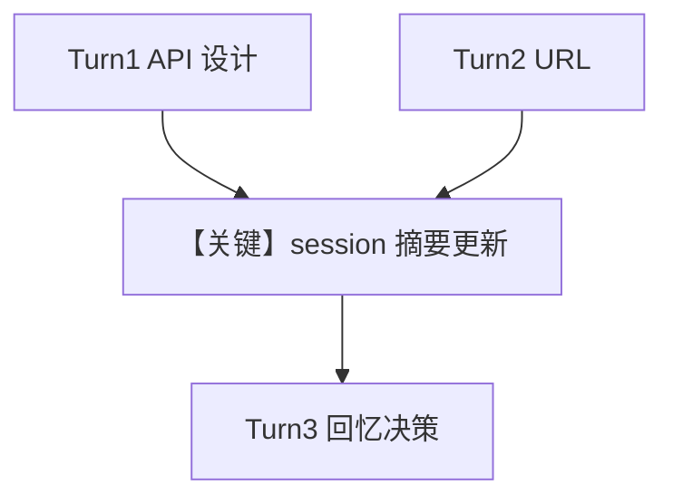

# 3a_session_context_summary.py — 实现原理分析

> 源文件：`cookbook/08_learning/01_basics/3a_session_context_summary.py`

## 概述

本示例展示 **`session_context=True`（默认 Summary）** 与 **显式 `instructions`**：在同一会话多轮内维护「当前讨论摘要」，适合需要连贯但不需要规划结构的对话。

**核心配置一览：**

| 配置项 | 值 | 说明 |
|--------|------|------|
| `model` | `OpenAIResponses(id="gpt-5.2")` | Responses API |
| `db` | `PostgresDb(...)` | 持久化 |
| `instructions` | `"Be very concise. Give brief answers in 1-2 sentences."` | 显式约束回答长度 |
| `learning` | `LearningMachine(session_context=True)` | 启用会话上下文（默认非 planning） |
| `markdown` | `True` | 是 |

## 核心组件解析

### Session context store

`session_context=True` 使用默认 `SessionContextConfig`；`enable_planning` 为假时侧重运行摘要而非目标/步骤结构。对比 `3b_session_context_planning.py`。

### 运行机制与因果链

同一 `session_id` 下多轮后，`build_context` 注入的会话摘要应覆盖「PUT vs PATCH」「URL 结构」等已讨论内容，第三轮「我们定了什么」依赖该摘要。

## System Prompt 组装

可静态还原的 `instructions` 原文：

```text
Be very concise. Give brief answers in 1-2 sentences.
```

在 `get_system_message` 中进入 `# 3.3.3`（无 `use_instruction_tags` 时直接拼接），并与：

```text
<additional_information>
- Use markdown to format your answers.
</additional_information>
```

组合；再经 `# 3.3.12` 附加会话上下文块（运行时内容）。

### 段落释义（模型视角）

- 简短指令强制 1–2 句，压缩 token 并突出 session 摘要的作用。

## 完整 API 请求

```python
client.responses.create(model="gpt-5.2", input=[...])
```

## Mermaid 流程图



## 关键源码文件索引

| 文件 | 作用 |
|------|------|
| `agno/learn/` session context store | 摘要读写与 `build_context` |
| `agno/agent/_messages.py` | #3.3.12 |
