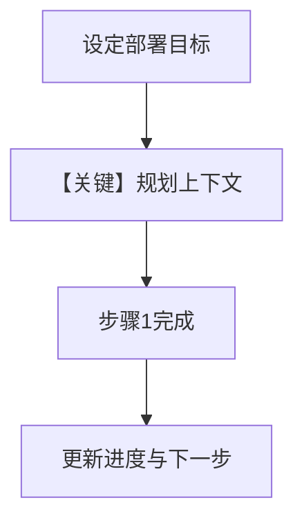

# 3b_session_context_planning.py — 实现原理分析

<!-- cookbook-py-source:start -->
## 完整源码

```python
"""
Session Context: Planning Mode
==============================
Session Context tracks the current conversation's state:
- What's been discussed
- Current goals and their status
- Active plans and progress

Planning mode (enable_planning=True) adds structured goal tracking -
summary plus goal, plan steps, and progress markers.

Compare with: 3a_session_context_summary.py for lightweight tracking.
"""

from agno.agent import Agent
from agno.db.postgres import PostgresDb
from agno.learn import LearningMachine, SessionContextConfig
from agno.models.openai import OpenAIResponses

# ---------------------------------------------------------------------------
# Create Agent
# ---------------------------------------------------------------------------

db = PostgresDb(db_url="postgresql+psycopg://ai:ai@localhost:5532/ai")

# Planning mode: Tracks goals, plans, and progress in addition to summary.
# Good for task-oriented conversations where you want structured progress.
agent = Agent(
    model=OpenAIResponses(id="gpt-5.2"),
    db=db,
    instructions="Be very concise. Give brief, actionable answers.",
    learning=LearningMachine(
        session_context=SessionContextConfig(
            enable_planning=True,
        ),
    ),
    markdown=True,
)

# ---------------------------------------------------------------------------
# Run Demo
# ---------------------------------------------------------------------------

if __name__ == "__main__":
    user_id = "planner@example.com"
    session_id = "deploy_app"

    # Turn 1: Set a goal with clear steps
    print("\n" + "=" * 60)
    print("TURN 1: Set goal")
    print("=" * 60 + "\n")

    agent.print_response(
        "Help me deploy a Python app to production. Give me 3 steps.",
        user_id=user_id,
        session_id=session_id,
        stream=True,
    )
    agent.learning_machine.session_context_store.print(session_id=session_id)

    # Turn 2: Complete first step
    print("\n" + "=" * 60)
    print("TURN 2: Complete step 1")
    print("=" * 60 + "\n")

    agent.print_response(
        "Done with step 1. What's the command for step 2?",
        user_id=user_id,
        session_id=session_id,
        stream=True,
    )
    agent.learning_machine.session_context_store.print(session_id=session_id)

    # Turn 3: Complete second step
    print("\n" + "=" * 60)
    print("TURN 3: Complete step 2")
    print("=" * 60 + "\n")

    agent.print_response(
        "Step 2 done. What's left?",
        user_id=user_id,
        session_id=session_id,
        stream=True,
    )
    agent.learning_machine.session_context_store.print(session_id=session_id)
```

<!-- cookbook-py-source:end -->

> 源文件：`cookbook/08_learning/01_basics/3b_session_context_planning.py`

## 概述

本示例展示 **`SessionContextConfig(enable_planning=True)`**：在会话摘要之外跟踪目标、步骤与完成度，适合任务型多轮对话。

**核心配置一览：**

| 配置项 | 值 | 说明 |
|--------|------|------|
| `instructions` | `"Be very concise. Give brief, actionable answers."` | 可执行向短答 |
| `learning` | `LearningMachine(session_context=SessionContextConfig(enable_planning=True))` | 规划型会话上下文 |
| `model` / `db` / `markdown` | 同系列示例 | — |

## 核心组件解析

### 与 3a 的差异

| 维度 | 3a Summary | 3b Planning |
|------|--------------|-------------|
| 结构 | 轻量摘要 | 目标+步骤+进度 |
| 适用 | 闲聊/连贯讨论 | 部署步骤等任务流 |

## System Prompt 组装

静态还原 `instructions`：

```text
Be very concise. Give brief, actionable answers.
```

以及 markdown 附加块；`# 3.3.12` 注入含 planning 结构的会话状态（运行时）。

## 完整 API 请求

```python
client.responses.create(model="gpt-5.2", input=[...])
```

## Mermaid 流程图



## 关键源码文件索引

| 文件 | 作用 |
|------|------|
| `agno/learn/` SessionContextConfig | `enable_planning` 行为 |
