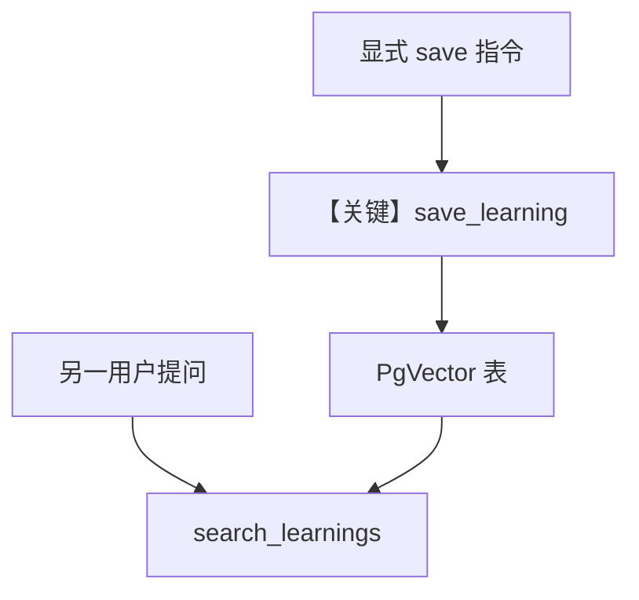

# 4_learned_knowledge.py — 实现原理分析

> 源文件：`cookbook/08_learning/01_basics/4_learned_knowledge.py`

## 概述

本示例展示 **Postgres + `PgVector` 的 Learned Knowledge（AGENTIC）**：与 `00_quickstart/03_learned_knowledge.py` 的 Chroma 版对照，向量表 `learned_knowledge_demo` 与同一 `db_url` 共用基础设施。

**核心配置一览：**

| 配置项 | 值 | 说明 |
|--------|------|------|
| `instructions` | `"Be concise. Search for relevant learnings before answering questions."` | 强调先检索 |
| `db` | `PostgresDb(db_url=...)` | 与向量库同 URL |
| `knowledge` | `Knowledge(vector_db=PgVector(table_name="learned_knowledge_demo", search_type=hybrid, embedder=...))` | 混合检索 + OpenAI 嵌入 |
| `learning` | `LearningMachine(knowledge=..., learned_knowledge=LearnedKnowledgeConfig(mode=AGENTIC))` | 学得知识 AGENTIC |
| `markdown` | `True` | 是 |

## 核心组件解析

### 与 03_learned_knowledge 的差异

存储后端：`PgVector` vs `ChromaDb`；其余模式（AGENTIC、`search_learnings`/`save_learning`）一致。

### 运行机制与因果链

第一轮显式要求「保存」触发写入；第二轮换用户问相关领域问题，应命中先前学得条目。

## System Prompt 组装

本文件**显式** `instructions` 原样还原：

```text
Be concise. Search for relevant learnings before answering questions.
```

并配合默认：

```text
<additional_information>
- Use markdown to format your answers.
</additional_information>
```

再加 `LearnedKnowledgeStore` AGENTIC 长文规则（源码固定于 `learned_knowledge.py`）与 `# 3.3.12` 动态检索片段。

## 完整 API 请求

```python
client.responses.create(model="gpt-5.2", input=[...], tools=[...])
```

## Mermaid 流程图



## 关键源码文件索引

| 文件 | 作用 |
|------|------|
| `agno/vectordb/pgvector` | PgVector 适配 |
| `agno/learn/stores/learned_knowledge.py` | AGENTIC 规则正文 |
