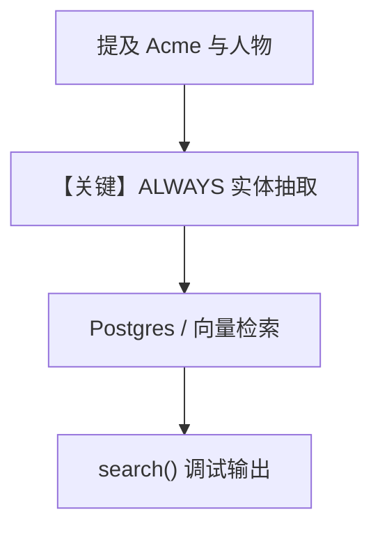

# 5a_entity_memory_always.py — 实现原理分析

> 源文件：`cookbook/08_learning/01_basics/5a_entity_memory_always.py`

## 概述

本示例展示 **`EntityMemoryConfig(mode=ALWAYS)`**：从对话中自动抽取公司/人物等外部实体及事实，无显式工具，适合销售笔记等场景。

**核心配置一览：**

| 配置项 | 值 | 说明 |
|--------|------|------|
| `instructions` | `"You're a sales assistant. Acknowledge notes briefly."` | 角色与回答风格 |
| `learning` | `LearningMachine(entity_memory=EntityMemoryConfig(mode=ALWAYS))` | 实体记忆 ALWAYS |
| `model` | `OpenAIResponses(id="gpt-5.2")` | Responses API |
| `db` | `PostgresDb(...)` | Postgres |
| `markdown` | `True` | 是 |

## 核心组件解析

演示脚本用 `entity_memory_store.search(query="acme")` 展示抽取结果，验证跨 session 更新同一实体。

### 运行机制与因果链

第二轮追加融资信息时，ALWAYS 路径合并或更新实体图谱中的事实/事件（具体策略见 `EntityMemoryStore`）。

## System Prompt 组装

还原 `instructions`：

```text
You're a sales assistant. Acknowledge notes briefly.
```

以及：

```text
<additional_information>
- Use markdown to format your answers.
</additional_information>
```

`# 3.3.12` 注入实体相关上下文（运行时）。

## 完整 API 请求

```python
client.responses.create(model="gpt-5.2", input=[...])
```

## Mermaid 流程图



## 关键源码文件索引

| 文件 | 作用 |
|------|------|
| `agno/learn/stores/` entity memory | ALWAYS 抽取与检索 |
