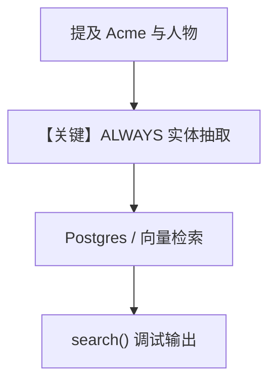

# 5a_entity_memory_always.py — 实现原理分析

<!-- cookbook-py-source:start -->
## 完整源码

```python
"""
Entity Memory: Always Mode
==========================
Entity Memory stores knowledge about external things:
- Companies, people, projects
- Facts, events, relationships
- Shared context across users

ALWAYS mode automatically extracts entity information from conversations.
No explicit tool calls - entities are discovered and saved behind the scenes.

Compare with: 5b_entity_memory_agentic.py for explicit tool-based management.
"""

from agno.agent import Agent
from agno.db.postgres import PostgresDb
from agno.learn import EntityMemoryConfig, LearningMachine, LearningMode
from agno.models.openai import OpenAIResponses

# ---------------------------------------------------------------------------
# Create Agent
# ---------------------------------------------------------------------------

db = PostgresDb(db_url="postgresql+psycopg://ai:ai@localhost:5532/ai")

# ALWAYS mode: Entities are extracted automatically after responses.
# The agent doesn't see memory tools - extraction happens invisibly.
agent = Agent(
    model=OpenAIResponses(id="gpt-5.2"),
    db=db,
    instructions="You're a sales assistant. Acknowledge notes briefly.",
    learning=LearningMachine(
        entity_memory=EntityMemoryConfig(
            mode=LearningMode.ALWAYS,
        ),
    ),
    markdown=True,
)

# ---------------------------------------------------------------------------
# Run Demo
# ---------------------------------------------------------------------------

if __name__ == "__main__":
    from rich.pretty import pprint

    user_id = "sales@example.com"

    # Session 1: Mention entities naturally
    print("\n" + "=" * 60)
    print("SESSION 1: Discuss entities (extraction happens automatically)")
    print("=" * 60 + "\n")

    agent.print_response(
        "Just met with Acme Corp. They're a fintech startup in SF, "
        "50 employees. CTO is Jane Smith. They use Python and Postgres.",
        user_id=user_id,
        session_id="session_1",
        stream=True,
    )

    print("\n--- Extracted Entities ---")
    entities = agent.learning_machine.entity_memory_store.search(query="acme", limit=10)
    pprint(entities)

    # Session 2: Add more info about same entity
    print("\n" + "=" * 60)
    print("SESSION 2: Update same entity")
    print("=" * 60 + "\n")

    agent.print_response(
        "Update on Acme Corp: they just raised $50M Series B from Sequoia. "
        "Jane Smith mentioned they're hiring 20 engineers.",
        user_id=user_id,
        session_id="session_2",
        stream=True,
    )

    print("\n--- Updated Entities ---")
    entities = agent.learning_machine.entity_memory_store.search(query="acme", limit=10)
    pprint(entities)
```

<!-- cookbook-py-source:end -->

> 源文件：`cookbook/08_learning/01_basics/5a_entity_memory_always.py`

## 概述

本示例展示 **`EntityMemoryConfig(mode=ALWAYS)`**：从对话中自动抽取公司/人物等外部实体及事实，无显式工具，适合销售笔记等场景。

**核心配置一览：**

| 配置项 | 值 | 说明 |
|--------|------|------|
| `instructions` | `"You're a sales assistant. Acknowledge notes briefly."` | 角色与回答风格 |
| `learning` | `LearningMachine(entity_memory=EntityMemoryConfig(mode=ALWAYS))` | 实体记忆 ALWAYS |
| `model` | `OpenAIResponses(id="gpt-5.2")` | Responses API |
| `db` | `PostgresDb(...)` | Postgres |
| `markdown` | `True` | 是 |

## 核心组件解析

演示脚本用 `entity_memory_store.search(query="acme")` 展示抽取结果，验证跨 session 更新同一实体。

### 运行机制与因果链

第二轮追加融资信息时，ALWAYS 路径合并或更新实体图谱中的事实/事件（具体策略见 `EntityMemoryStore`）。

## System Prompt 组装

还原 `instructions`：

```text
You're a sales assistant. Acknowledge notes briefly.
```

以及：

```text
<additional_information>
- Use markdown to format your answers.
</additional_information>
```

`# 3.3.12` 注入实体相关上下文（运行时）。

## 完整 API 请求

```python
client.responses.create(model="gpt-5.2", input=[...])
```

## Mermaid 流程图



## 关键源码文件索引

| 文件 | 作用 |
|------|------|
| `agno/learn/stores/` entity memory | ALWAYS 抽取与检索 |
