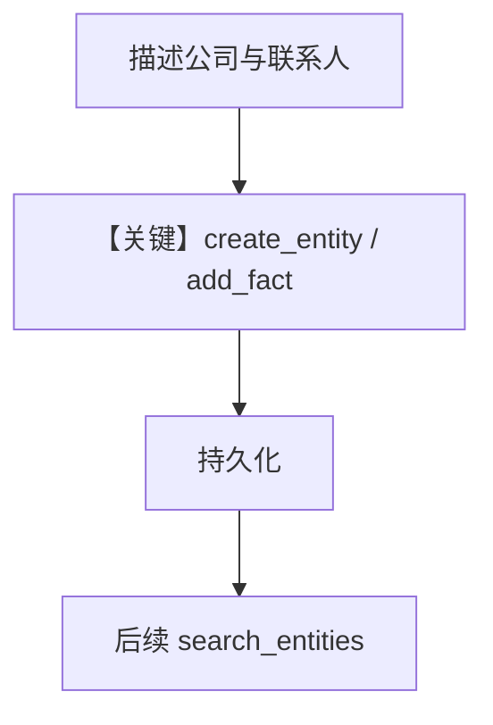

# 5b_entity_memory_agentic.py — 实现原理分析

<!-- cookbook-py-source:start -->
## 完整源码

```python
"""
Entity Memory: Agentic Mode
===========================
Entity Memory stores knowledge about external things:
- Companies, people, projects
- Facts, events, relationships
- Shared context across users

AGENTIC mode gives the agent explicit tools to manage entities:
- search_entities, create_entity
- add_fact, add_event, add_relationship

The agent decides when to store and retrieve information.

Compare with: 5a_entity_memory_always.py for automatic extraction.
"""

from agno.agent import Agent
from agno.db.postgres import PostgresDb
from agno.learn import EntityMemoryConfig, LearningMachine, LearningMode
from agno.models.openai import OpenAIResponses

# ---------------------------------------------------------------------------
# Create Agent
# ---------------------------------------------------------------------------

db = PostgresDb(db_url="postgresql+psycopg://ai:ai@localhost:5532/ai")

# AGENTIC mode: Agent gets entity tools and decides when to use them.
# You'll see tool calls like "create_entity", "add_fact" in responses.
agent = Agent(
    model=OpenAIResponses(id="gpt-5.2"),
    db=db,
    instructions=(
        "You're a sales assistant tracking companies and contacts. "
        "Be concise. Always search for existing entities before creating new ones."
    ),
    learning=LearningMachine(
        entity_memory=EntityMemoryConfig(
            mode=LearningMode.AGENTIC,
        ),
    ),
    markdown=True,
)

# ---------------------------------------------------------------------------
# Run Demo
# ---------------------------------------------------------------------------

if __name__ == "__main__":
    from rich.pretty import pprint

    user_id = "sales@example.com"

    # Session 1: Create entity
    print("\n" + "=" * 60)
    print("SESSION 1: Create entity (watch for tool calls)")
    print("=" * 60 + "\n")

    agent.print_response(
        "Track Acme Corp - fintech startup in SF, 50 employees, "
        "uses Python and Postgres. CTO is Jane Smith.",
        user_id=user_id,
        session_id="session_1",
        stream=True,
    )

    print("\n--- Created Entities ---")
    entities = agent.learning_machine.entity_memory_store.search(query="acme", limit=10)
    pprint(entities)

    # Session 2: Update same entity
    print("\n" + "=" * 60)
    print("SESSION 2: Update existing entity")
    print("=" * 60 + "\n")

    agent.print_response(
        "Acme Corp just raised $50M Series B from Sequoia.",
        user_id=user_id,
        session_id="session_2",
        stream=True,
    )

    print("\n--- Updated Entities ---")
    entities = agent.learning_machine.entity_memory_store.search(query="acme", limit=10)
    pprint(entities)
```

<!-- cookbook-py-source:end -->

> 源文件：`cookbook/08_learning/01_basics/5b_entity_memory_agentic.py`

## 概述

本示例展示 **`EntityMemoryConfig(mode=AGENTIC)`**：提供 `search_entities`、`create_entity`、`add_fact` 等工具，模型显式维护实体与关系。

**核心配置一览：**

| 配置项 | 值 | 说明 |
|--------|------|------|
| `instructions` | 多行：销售助理、简洁、先搜再建 | 约束工具使用策略 |
| `learning` | `EntityMemoryConfig(mode=AGENTIC)` | AGENTIC |
| 其余 | `OpenAIResponses`、`PostgresDb`、`markdown=True` | — |

## System Prompt 组装

还原 `instructions` 原文：

```text
You're a sales assistant tracking companies and contacts. Be concise. Always search for existing entities before creating new ones.
```

（实际 `.py` 中为括号元组拼接的连续字符串，语义同上。）

外加实体工具文档与 `# 3.3.12` 块。

## 完整 API 请求

```python
client.responses.create(model="gpt-5.2", input=[...], tools=[...])
```

## Mermaid 流程图



## 关键源码文件索引

| 文件 | 作用 |
|------|------|
| `agno/learn/stores/` entity memory | AGENTIC 工具集 |
