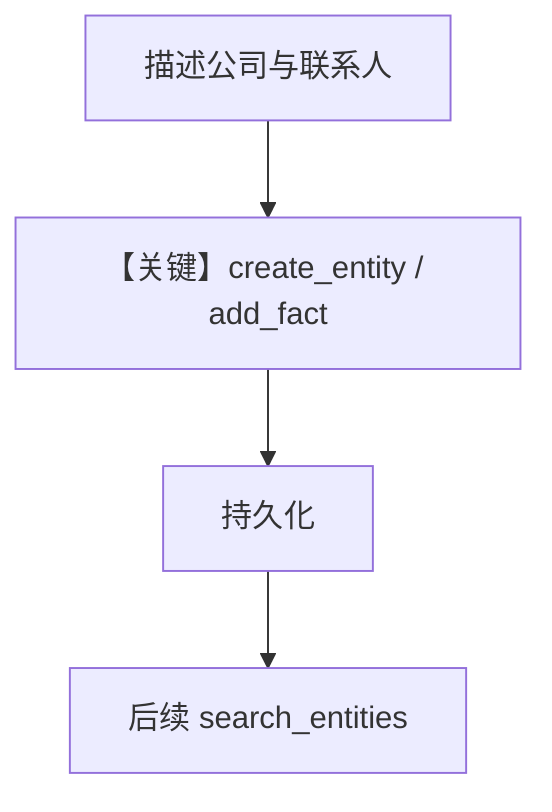

# 5b_entity_memory_agentic.py — 实现原理分析

> 源文件：`cookbook/08_learning/01_basics/5b_entity_memory_agentic.py`

## 概述

本示例展示 **`EntityMemoryConfig(mode=AGENTIC)`**：提供 `search_entities`、`create_entity`、`add_fact` 等工具，模型显式维护实体与关系。

**核心配置一览：**

| 配置项 | 值 | 说明 |
|--------|------|------|
| `instructions` | 多行：销售助理、简洁、先搜再建 | 约束工具使用策略 |
| `learning` | `EntityMemoryConfig(mode=AGENTIC)` | AGENTIC |
| 其余 | `OpenAIResponses`、`PostgresDb`、`markdown=True` | — |

## System Prompt 组装

还原 `instructions` 原文：

```text
You're a sales assistant tracking companies and contacts. Be concise. Always search for existing entities before creating new ones.
```

（实际 `.py` 中为括号元组拼接的连续字符串，语义同上。）

外加实体工具文档与 `# 3.3.12` 块。

## 完整 API 请求

```python
client.responses.create(model="gpt-5.2", input=[...], tools=[...])
```

## Mermaid 流程图



## 关键源码文件索引

| 文件 | 作用 |
|------|------|
| `agno/learn/stores/` entity memory | AGENTIC 工具集 |
