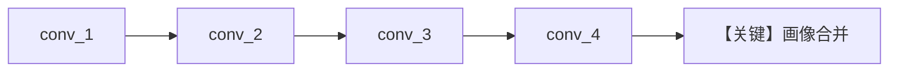

# 01_always_extraction.py — 实现原理分析

<!-- cookbook-py-source:start -->
## 完整源码

```python
"""
User Profile: Always Extraction (Deep Dive)
============================================
Automatic profile extraction from natural conversation.

ALWAYS mode extracts profile information in the background after each response.
The user doesn't see tools - extraction happens invisibly.

This example shows gradual profile building across multiple conversations.

Compare with: 02_agentic_mode.py for explicit tool-based updates.
See also: 01_basics/1a_user_profile_always.py for the basics.
"""

from agno.agent import Agent
from agno.db.postgres import PostgresDb
from agno.learn import LearningMachine, LearningMode, UserProfileConfig
from agno.models.openai import OpenAIResponses

# ---------------------------------------------------------------------------
# Create Agent
# ---------------------------------------------------------------------------

db = PostgresDb(db_url="postgresql+psycopg://ai:ai@localhost:5532/ai")

agent = Agent(
    model=OpenAIResponses(id="gpt-5.2"),
    db=db,
    learning=LearningMachine(
        user_profile=UserProfileConfig(
            mode=LearningMode.ALWAYS,
        ),
    ),
    markdown=True,
)

# ---------------------------------------------------------------------------
# Run: Gradual Profile Building
# ---------------------------------------------------------------------------

if __name__ == "__main__":
    user_id = "marcus@example.com"

    # Conversation 1: Basic introduction
    print("\n" + "=" * 60)
    print("CONVERSATION 1: Basic introduction")
    print("=" * 60 + "\n")

    agent.print_response(
        "Hi! I'm Marcus, nice to meet you.",
        user_id=user_id,
        session_id="conv_1",
        stream=True,
    )
    agent.learning_machine.user_profile_store.print(user_id=user_id)

    # Conversation 2: Share work context
    print("\n" + "=" * 60)
    print("CONVERSATION 2: Work context")
    print("=" * 60 + "\n")

    agent.print_response(
        "I'm a senior engineer at Stripe, focusing on payment systems.",
        user_id=user_id,
        session_id="conv_2",
        stream=True,
    )
    agent.learning_machine.user_profile_store.print(user_id=user_id)

    # Conversation 3: Preferences
    print("\n" + "=" * 60)
    print("CONVERSATION 3: Preferences (implicit extraction)")
    print("=" * 60 + "\n")

    agent.print_response(
        "I prefer code examples over long explanations. "
        "I'm very familiar with Python and Go.",
        user_id=user_id,
        session_id="conv_3",
        stream=True,
    )
    agent.learning_machine.user_profile_store.print(user_id=user_id)

    # Conversation 4: Nickname
    print("\n" + "=" * 60)
    print("CONVERSATION 4: Preferred name update")
    print("=" * 60 + "\n")

    agent.print_response(
        "By the way, most people call me Marc.",
        user_id=user_id,
        session_id="conv_4",
        stream=True,
    )
    agent.learning_machine.user_profile_store.print(user_id=user_id)
```

<!-- cookbook-py-source:end -->

> 源文件：`cookbook/08_learning/02_user_profile/01_always_extraction.py`

## 概述

本示例为 **User Profile ALWAYS** 的深入版：多会话、多 `session_id` 逐步丰富同一 `user_id` 的画像，展示渐进式抽取。

**核心配置一览：**

| 配置项 | 值 | 说明 |
|--------|------|------|
| `learning` | `LearningMachine(user_profile=UserProfileConfig(mode=ALWAYS))` | 无自定义 schema |
| `instructions` | 未设置 | 未设置 |
| `model` / `db` / `markdown` | `OpenAIResponses`、`PostgresDb`、`True` | — |

## 核心组件解析

与 `01_basics/1a_user_profile_always.py` 机制相同，区别在演示脚本轮次更多（介绍→工作→偏好→昵称）。

### 运行机制与因果链

同一 `user_id` 下 `conv_1`…`conv_4` 模拟长期关系；每轮后 `user_profile_store.print` 展示累积字段。

## System Prompt 组装

无自定义 instructions，静态最小块为 markdown 附加信息；`# 3.3.12` 带画像内容随轮次增长。

```text
<additional_information>
- Use markdown to format your answers.
</additional_information>
```

## 完整 API 请求

```python
client.responses.create(model="gpt-5.2", input=[...])
```

## Mermaid 流程图



## 关键源码文件索引

| 文件 | 作用 |
|------|------|
| `agno/learn/stores/user_profile.py` | ALWAYS 抽取 |
