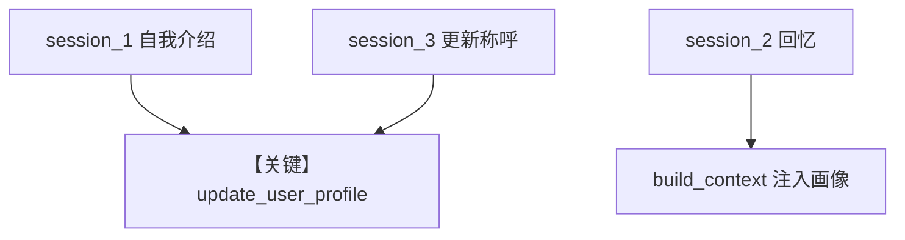

# 02_agentic_mode.py — 实现原理分析

> 源文件：`cookbook/08_learning/02_user_profile/02_agentic_mode.py`

## 概述

本示例为 **User Profile AGENTIC** 深入版：`instructions` 明确要求在用户分享姓名/偏好时调用 `update_user_profile`，并演示多 session 回忆与更新称呼。

**核心配置一览：**

| 配置项 | 值 | 说明 |
|--------|------|------|
| `instructions` | 见下「还原」 | 引导工具使用 |
| `learning` | `UserProfileConfig(mode=AGENTIC)` | — |

### 还原后的完整 System 文本（用户可配置部分）

```text
You are a helpful assistant. When users share their name or preferences, use update_user_profile to save it.
```

与 `additional_information` 中的 markdown 行组合；再加 AGENTIC 工具说明与 `# 3.3.12`。

## 完整 API 请求

```python
client.responses.create(model="gpt-5.2", input=[...], tools=[...])
```

## Mermaid 流程图



## 关键源码文件索引

| 文件 | 作用 |
|------|------|
| `agno/learn/stores/user_profile.py` | AGENTIC 工具 |
