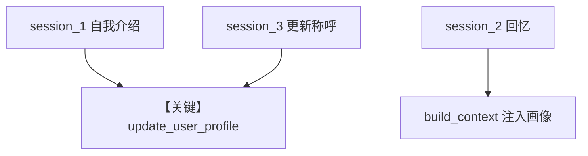

# 02_agentic_mode.py — 实现原理分析

<!-- cookbook-py-source:start -->
## 完整源码

```python
"""
User Profile: Agentic Mode (Deep Dive)
======================================
Agent-controlled profile updates via explicit tools.

AGENTIC mode gives the agent a tool to update profile fields.
You'll see tool calls in the response - more transparent than ALWAYS mode.

Compare with: 01_always_extraction.py for automatic extraction.
See also: 01_basics/1b_user_profile_agentic.py for the basics.
"""

from agno.agent import Agent
from agno.db.postgres import PostgresDb
from agno.learn import LearningMachine, LearningMode, UserProfileConfig
from agno.models.openai import OpenAIResponses

# ---------------------------------------------------------------------------
# Create Agent
# ---------------------------------------------------------------------------

db = PostgresDb(db_url="postgresql+psycopg://ai:ai@localhost:5532/ai")

agent = Agent(
    model=OpenAIResponses(id="gpt-5.2"),
    db=db,
    instructions=(
        "You are a helpful assistant. "
        "When users share their name or preferences, use update_user_profile to save it."
    ),
    learning=LearningMachine(
        user_profile=UserProfileConfig(
            mode=LearningMode.AGENTIC,
        ),
    ),
    markdown=True,
)

# ---------------------------------------------------------------------------
# Run Demo
# ---------------------------------------------------------------------------

if __name__ == "__main__":
    user_id = "jordan@example.com"

    # Session 1: Share name - watch for tool calls
    print("\n" + "=" * 60)
    print("SESSION 1: Share name (watch for tool calls)")
    print("=" * 60 + "\n")

    agent.print_response(
        "Hi! I'm Jordan Chen, but everyone calls me JC.",
        user_id=user_id,
        session_id="session_1",
        stream=True,
    )
    agent.learning_machine.user_profile_store.print(user_id=user_id)

    # Session 2: Recall in new session
    print("\n" + "=" * 60)
    print("SESSION 2: Profile recalled in new session")
    print("=" * 60 + "\n")

    agent.print_response(
        "What's my name and what should you call me?",
        user_id=user_id,
        session_id="session_2",
        stream=True,
    )
    agent.learning_machine.user_profile_store.print(user_id=user_id)

    # Session 3: Update preferred name
    print("\n" + "=" * 60)
    print("SESSION 3: Update preferred name")
    print("=" * 60 + "\n")

    agent.print_response(
        "Actually, I'd prefer you call me Jordan from now on.",
        user_id=user_id,
        session_id="session_3",
        stream=True,
    )
    agent.learning_machine.user_profile_store.print(user_id=user_id)
```

<!-- cookbook-py-source:end -->

> 源文件：`cookbook/08_learning/02_user_profile/02_agentic_mode.py`

## 概述

本示例为 **User Profile AGENTIC** 深入版：`instructions` 明确要求在用户分享姓名/偏好时调用 `update_user_profile`，并演示多 session 回忆与更新称呼。

**核心配置一览：**

| 配置项 | 值 | 说明 |
|--------|------|------|
| `instructions` | 见下「还原」 | 引导工具使用 |
| `learning` | `UserProfileConfig(mode=AGENTIC)` | — |

### 还原后的完整 System 文本（用户可配置部分）

```text
You are a helpful assistant. When users share their name or preferences, use update_user_profile to save it.
```

与 `additional_information` 中的 markdown 行组合；再加 AGENTIC 工具说明与 `# 3.3.12`。

## 完整 API 请求

```python
client.responses.create(model="gpt-5.2", input=[...], tools=[...])
```

## Mermaid 流程图



## 关键源码文件索引

| 文件 | 作用 |
|------|------|
| `agno/learn/stores/user_profile.py` | AGENTIC 工具 |
