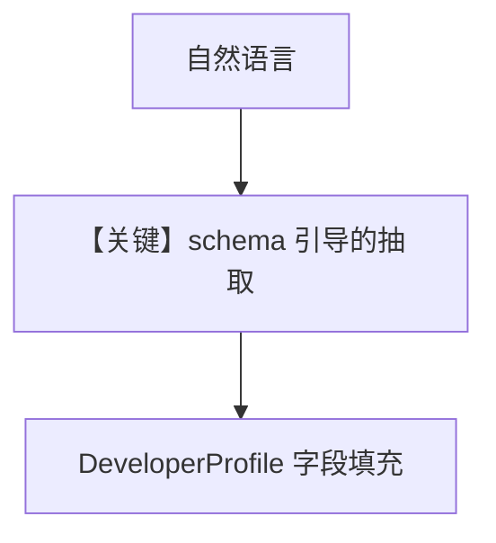

# 03_custom_schema.py — 实现原理分析

> 源文件：`cookbook/08_learning/02_user_profile/03_custom_schema.py`

## 概述

本示例展示 **`UserProfileConfig(schema=DeveloperProfile)`**：用继承 `UserProfile` 的 dataclass 定义 `company`、`role`、`primary_language` 等字段，抽取时按字段 `metadata["description"]` 对齐自然语言。

**核心配置一览：**

| 配置项 | 值 | 说明 |
|--------|------|------|
| `learning` | `UserProfileConfig(mode=ALWAYS, schema=DeveloperProfile)` | 自定义画像模式 |
| `instructions` | 未设置 | 未设置 |

## 核心组件解析

自定义 schema 影响持久化结构与 LLM 抽取目标字段；`user_profile_store.print` 展示结构化结果。

### 运行机制与因果链

多轮对话分别填充职业年限、技术栈等，第三轮问微服务结构时应能利用已抽取字段做个性化建议。

## System Prompt 组装

仅默认 markdown 附加块 + `# 3.3.12` 中带字段化画像（运行时）。

## 完整 API 请求

```python
client.responses.create(model="gpt-5.2", input=[...])
```

## Mermaid 流程图



## 关键源码文件索引

| 文件 | 作用 |
|------|------|
| `agno/learn/schemas.py` | `UserProfile` 基类 |
| `agno/learn/stores/user_profile.py` | schema 驱动的抽取 |
