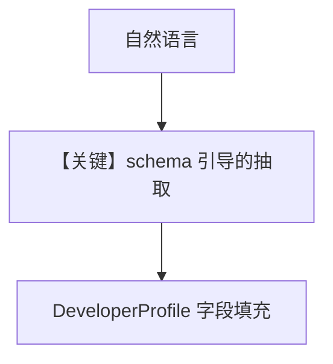

# 03_custom_schema.py — 实现原理分析

<!-- cookbook-py-source:start -->
## 完整源码

```python
"""
User Profile: Custom Schema
===========================
Define your own profile structure with a dataclass.

Use custom schemas when you want specific fields (e.g., role, department)
instead of the default free-form profile.

Compare with: 01_always_extraction.py for default schema.
See also: 01_basics/1a_user_profile_always.py for the basics.
"""

from dataclasses import dataclass, field
from typing import Optional

from agno.agent import Agent
from agno.db.postgres import PostgresDb
from agno.learn import LearningMachine, LearningMode, UserProfileConfig
from agno.learn.schemas import UserProfile
from agno.models.openai import OpenAIResponses

# ---------------------------------------------------------------------------
# Custom Profile Schema
# ---------------------------------------------------------------------------


@dataclass
class DeveloperProfile(UserProfile):
    """Profile schema for developers. Each field has a description the LLM uses."""

    company: Optional[str] = field(
        default=None, metadata={"description": "Company or organization"}
    )
    role: Optional[str] = field(
        default=None, metadata={"description": "Job title (e.g., Senior Engineer)"}
    )
    primary_language: Optional[str] = field(
        default=None, metadata={"description": "Main programming language"}
    )
    languages: Optional[list[str]] = field(
        default=None, metadata={"description": "All programming languages they know"}
    )
    frameworks: Optional[list[str]] = field(
        default=None, metadata={"description": "Frameworks and libraries they use"}
    )
    experience_years: Optional[int] = field(
        default=None, metadata={"description": "Years of programming experience"}
    )


# ---------------------------------------------------------------------------
# Create Agent
# ---------------------------------------------------------------------------

db = PostgresDb(db_url="postgresql+psycopg://ai:ai@localhost:5532/ai")

agent = Agent(
    model=OpenAIResponses(id="gpt-5.2"),
    db=db,
    learning=LearningMachine(
        user_profile=UserProfileConfig(
            mode=LearningMode.ALWAYS,
            schema=DeveloperProfile,
        ),
    ),
    markdown=True,
)

# ---------------------------------------------------------------------------
# Run Demo
# ---------------------------------------------------------------------------

if __name__ == "__main__":
    user_id = "alex@example.com"

    # Share info that maps to schema fields
    print("\n" + "=" * 60)
    print("CONVERSATION 1: Introduction")
    print("=" * 60 + "\n")

    agent.print_response(
        "Hi! I'm Alex Chen, a senior backend engineer at Stripe. "
        "I've been coding for about 12 years now.",
        user_id=user_id,
        session_id="conv_1",
        stream=True,
    )
    agent.learning_machine.user_profile_store.print(user_id=user_id)

    # Add tech stack details
    print("\n" + "=" * 60)
    print("CONVERSATION 2: Tech stack")
    print("=" * 60 + "\n")

    agent.print_response(
        "I mainly work with Go and Python. For Python, I use FastAPI "
        "and SQLAlchemy a lot. I'm also familiar with Rust.",
        user_id=user_id,
        session_id="conv_2",
        stream=True,
    )
    agent.learning_machine.user_profile_store.print(user_id=user_id)

    # Test personalization
    print("\n" + "=" * 60)
    print("CONVERSATION 3: Personalized response")
    print("=" * 60 + "\n")

    agent.print_response(
        "How should I structure a new microservice?",
        user_id=user_id,
        session_id="conv_3",
        stream=True,
    )
```

<!-- cookbook-py-source:end -->

> 源文件：`cookbook/08_learning/02_user_profile/03_custom_schema.py`

## 概述

本示例展示 **`UserProfileConfig(schema=DeveloperProfile)`**：用继承 `UserProfile` 的 dataclass 定义 `company`、`role`、`primary_language` 等字段，抽取时按字段 `metadata["description"]` 对齐自然语言。

**核心配置一览：**

| 配置项 | 值 | 说明 |
|--------|------|------|
| `learning` | `UserProfileConfig(mode=ALWAYS, schema=DeveloperProfile)` | 自定义画像模式 |
| `instructions` | 未设置 | 未设置 |

## 核心组件解析

自定义 schema 影响持久化结构与 LLM 抽取目标字段；`user_profile_store.print` 展示结构化结果。

### 运行机制与因果链

多轮对话分别填充职业年限、技术栈等，第三轮问微服务结构时应能利用已抽取字段做个性化建议。

## System Prompt 组装

仅默认 markdown 附加块 + `# 3.3.12` 中带字段化画像（运行时）。

## 完整 API 请求

```python
client.responses.create(model="gpt-5.2", input=[...])
```

## Mermaid 流程图



## 关键源码文件索引

| 文件 | 作用 |
|------|------|
| `agno/learn/schemas.py` | `UserProfile` 基类 |
| `agno/learn/stores/user_profile.py` | schema 驱动的抽取 |
