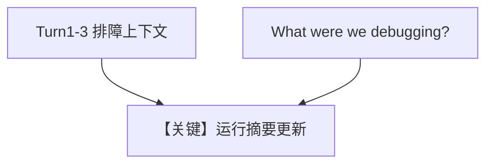

# 01_summary_mode.py — 实现原理分析

> 源文件：`cookbook/08_learning/03_session_context/01_summary_mode.py`

## 概述

本示例为 **Session Context Summary** 深入版：显式 `SessionContextConfig(enable_planning=False)`，多轮调试场景下累积摘要并模拟重连后回忆。

**核心配置一览：**

| 配置项 | 值 | 说明 |
|--------|------|------|
| `learning` | `LearningMachine(session_context=SessionContextConfig(enable_planning=False))` | 仅摘要 |
| `instructions` | 未设置 | 未设置 |

## 核心组件解析

第四轮「What were we debugging?」依赖同一 `session_id` 下持久化的会话摘要。

## System Prompt 组装

```text
<additional_information>
- Use markdown to format your answers.
</additional_information>
```

加 `# 3.3.12` 中会话摘要（含 FastAPI、内存泄漏等运行时内容）。

## 完整 API 请求

```python
client.responses.create(model="gpt-5.2", input=[...])
```

## Mermaid 流程图



## 关键源码文件索引

| 文件 | 作用 |
|------|------|
| session context store | `enable_planning=False` |
