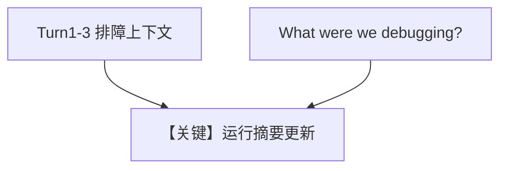

# 01_summary_mode.py — 实现原理分析

<!-- cookbook-py-source:start -->
## 完整源码

```python
"""
Session Context: Summary Mode (Deep Dive)
=========================================
Running summary of conversation state.

Summary mode maintains a running summary of the conversation that
persists across reconnections. Each turn, the summary is updated
to include the new information.

Compare with: 02_planning_mode.py for goal/plan tracking.
See also: 01_basics/3a_session_context_summary.py for the basics.
"""

from agno.agent import Agent
from agno.db.postgres import PostgresDb
from agno.learn import LearningMachine, SessionContextConfig
from agno.models.openai import OpenAIResponses

# ---------------------------------------------------------------------------
# Create Agent
# ---------------------------------------------------------------------------

db = PostgresDb(db_url="postgresql+psycopg://ai:ai@localhost:5532/ai")

agent = Agent(
    model=OpenAIResponses(id="gpt-5.2"),
    db=db,
    learning=LearningMachine(
        session_context=SessionContextConfig(
            enable_planning=False,  # Summary only
        ),
    ),
    markdown=True,
)

# ---------------------------------------------------------------------------
# Run: Multi-Turn Summary
# ---------------------------------------------------------------------------

if __name__ == "__main__":
    user_id = "debug@example.com"
    session_id = "debug_session"

    # Turn 1: Initial question
    print("\n" + "=" * 60)
    print("TURN 1: Initial question")
    print("=" * 60 + "\n")

    agent.print_response(
        "I'm debugging a memory leak in my Python FastAPI server. "
        "It processes large JSON payloads.",
        user_id=user_id,
        session_id=session_id,
        stream=True,
    )
    agent.learning_machine.session_context_store.print(session_id=session_id)

    # Turn 2: More context
    print("\n" + "=" * 60)
    print("TURN 2: More context")
    print("=" * 60 + "\n")

    agent.print_response(
        "The memory grows even when there's no traffic. "
        "I've checked for unclosed file handles already.",
        user_id=user_id,
        session_id=session_id,
        stream=True,
    )
    agent.learning_machine.session_context_store.print(session_id=session_id)

    # Turn 3: Follow-up
    print("\n" + "=" * 60)
    print("TURN 3: Follow-up")
    print("=" * 60 + "\n")

    agent.print_response(
        "Could it be related to Pydantic model caching?",
        user_id=user_id,
        session_id=session_id,
        stream=True,
    )
    agent.learning_machine.session_context_store.print(session_id=session_id)

    # Simulate reconnection
    print("\n" + "=" * 60)
    print("TURN 4: Recall after 'reconnection'")
    print("=" * 60 + "\n")

    agent.print_response(
        "What were we debugging?",
        user_id=user_id,
        session_id=session_id,
        stream=True,
    )
```

<!-- cookbook-py-source:end -->

> 源文件：`cookbook/08_learning/03_session_context/01_summary_mode.py`

## 概述

本示例为 **Session Context Summary** 深入版：显式 `SessionContextConfig(enable_planning=False)`，多轮调试场景下累积摘要并模拟重连后回忆。

**核心配置一览：**

| 配置项 | 值 | 说明 |
|--------|------|------|
| `learning` | `LearningMachine(session_context=SessionContextConfig(enable_planning=False))` | 仅摘要 |
| `instructions` | 未设置 | 未设置 |

## 核心组件解析

第四轮「What were we debugging?」依赖同一 `session_id` 下持久化的会话摘要。

## System Prompt 组装

```text
<additional_information>
- Use markdown to format your answers.
</additional_information>
```

加 `# 3.3.12` 中会话摘要（含 FastAPI、内存泄漏等运行时内容）。

## 完整 API 请求

```python
client.responses.create(model="gpt-5.2", input=[...])
```

## Mermaid 流程图



## 关键源码文件索引

| 文件 | 作用 |
|------|------|
| session context store | `enable_planning=False` |
