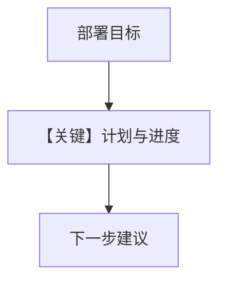

# 02_planning_mode.py — 实现原理分析

> 源文件：`cookbook/08_learning/03_session_context/02_planning_mode.py`

## 概述

本示例为 **Planning** 深入版：`enable_planning=True`，跟踪部署 AWS 应用的目标、步骤与完成度。

**核心配置一览：**

| 配置项 | 值 | 说明 |
|--------|------|------|
| `learning` | `SessionContextConfig(enable_planning=True)` | 目标/计划/进度 |

## 核心组件解析

每步后 `session_context_store.print` 展示结构化进度；最后「What next?」依赖规划上下文。

## System Prompt 组装

无自定义 `instructions`；`# 3.3.12` 含规划型会话块。

## 完整 API 请求

```python
client.responses.create(model="gpt-5.2", input=[...])
```

## Mermaid 流程图



## 关键源码文件索引

| 文件 | 作用 |
|------|------|
| SessionContextConfig | `enable_planning` |
