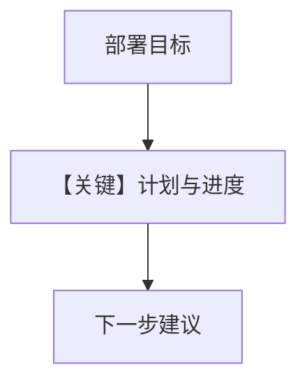

# 02_planning_mode.py — 实现原理分析

<!-- cookbook-py-source:start -->
## 完整源码

```python
"""
Session Context: Planning Mode (Deep Dive)
==========================================
Goal, plan, and progress tracking for task-oriented sessions.

Planning mode adds:
- Goal: What the user is trying to achieve
- Plan: Steps to reach the goal
- Progress: Completed steps

Use for task-oriented agents where tracking progress matters.

Compare with: 01_summary_mode.py for summary-only (faster).
See also: 01_basics/3b_session_context_planning.py for the basics.
"""

from agno.agent import Agent
from agno.db.postgres import PostgresDb
from agno.learn import LearningMachine, SessionContextConfig
from agno.models.openai import OpenAIResponses

# ---------------------------------------------------------------------------
# Create Agent
# ---------------------------------------------------------------------------

db = PostgresDb(db_url="postgresql+psycopg://ai:ai@localhost:5532/ai")

agent = Agent(
    model=OpenAIResponses(id="gpt-5.2"),
    db=db,
    learning=LearningMachine(
        session_context=SessionContextConfig(
            enable_planning=True,  # Track goal, plan, progress
        ),
    ),
    markdown=True,
)

# ---------------------------------------------------------------------------
# Run: Task Planning
# ---------------------------------------------------------------------------

if __name__ == "__main__":
    user_id = "deploy@example.com"
    session_id = "deploy_session"

    # Step 1: State the goal
    print("\n" + "=" * 60)
    print("STEP 1: State the goal")
    print("=" * 60 + "\n")

    agent.print_response(
        "I need to deploy a new Python web app to AWS. Help me plan this.",
        user_id=user_id,
        session_id=session_id,
        stream=True,
    )
    agent.learning_machine.session_context_store.print(session_id=session_id)

    # Step 2: Complete first task
    print("\n" + "=" * 60)
    print("STEP 2: First task done")
    print("=" * 60 + "\n")

    agent.print_response(
        "Done! I've created the Dockerfile and it builds successfully.",
        user_id=user_id,
        session_id=session_id,
        stream=True,
    )
    agent.learning_machine.session_context_store.print(session_id=session_id)

    # Step 3: More progress
    print("\n" + "=" * 60)
    print("STEP 3: More progress")
    print("=" * 60 + "\n")

    agent.print_response(
        "ECR repository is set up and I've pushed the image.",
        user_id=user_id,
        session_id=session_id,
        stream=True,
    )
    agent.learning_machine.session_context_store.print(session_id=session_id)

    # Step 4: What's next?
    print("\n" + "=" * 60)
    print("STEP 4: What's next?")
    print("=" * 60 + "\n")

    agent.print_response(
        "What should I do next?",
        user_id=user_id,
        session_id=session_id,
        stream=True,
    )
    agent.learning_machine.session_context_store.print(session_id=session_id)
```

<!-- cookbook-py-source:end -->

> 源文件：`cookbook/08_learning/03_session_context/02_planning_mode.py`

## 概述

本示例为 **Planning** 深入版：`enable_planning=True`，跟踪部署 AWS 应用的目标、步骤与完成度。

**核心配置一览：**

| 配置项 | 值 | 说明 |
|--------|------|------|
| `learning` | `SessionContextConfig(enable_planning=True)` | 目标/计划/进度 |

## 核心组件解析

每步后 `session_context_store.print` 展示结构化进度；最后「What next?」依赖规划上下文。

## System Prompt 组装

无自定义 `instructions`；`# 3.3.12` 含规划型会话块。

## 完整 API 请求

```python
client.responses.create(model="gpt-5.2", input=[...])
```

## Mermaid 流程图



## 关键源码文件索引

| 文件 | 作用 |
|------|------|
| SessionContextConfig | `enable_planning` |
