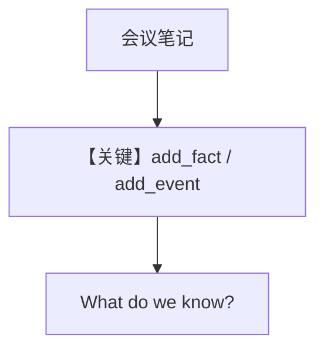

# 01_facts_and_events.py — 实现原理分析

> 源文件：`cookbook/08_learning/04_entity_memory/01_facts_and_events.py`

## 概述

本示例区分 **语义事实 vs 时序事件**：`instructions` 要求区分 timeless facts 与 time-bound events，`EntityMemoryConfig(AGENTIC, namespace="global")` 管理实体。

**核心配置一览：**

| 配置项 | 值 | 说明 |
|--------|------|------|
| `instructions` | 见下 | 事实/事件区分 |
| `learning` | `EntityMemoryConfig(mode=AGENTIC, namespace="global")` | 命名空间 global |

### 还原后的 instructions

```text
Track information about companies and people. Distinguish between facts (timeless) and events (time-bound).
```

## 核心组件解析

第一轮混合静态信息（地点、技术栈）与事件（客户数里程碑、融资）；后续检索与追问验证图结构。

## 完整 API 请求

```python
client.responses.create(model="gpt-5.2", input=[...], tools=[...])
```

## Mermaid 流程图



## 关键源码文件索引

| 文件 | 作用 |
|------|------|
| entity memory store | fact/event 类型 |
