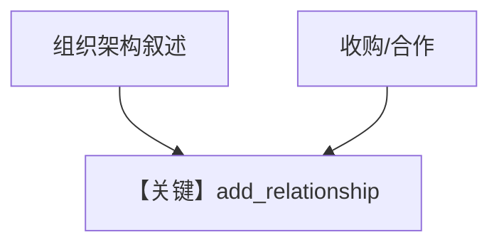

# 02_entity_relationships.py — 实现原理分析

> 源文件：`cookbook/08_learning/04_entity_memory/02_entity_relationships.py`

## 概述

本示例聚焦 **实体间关系**（汇报线、收购、合作等），`instructions` 要求使用 `works_at`、`reports_to` 等关系类型构建知识图谱。

**核心配置一览：**

| 配置项 | 值 | 说明 |
|--------|------|------|
| `instructions` | 见下 | 关系类型与图谱目标 |
| `learning` | `EntityMemoryConfig(mode=AGENTIC)` | 默认 namespace |

### 还原后的 instructions

```text
Build a knowledge graph of entities and their relationships. Use appropriate relation types: works_at, reports_to, acquired, depends_on, etc.
```

## 完整 API 请求

```python
client.responses.create(model="gpt-5.2", input=[...], tools=[...])
```

## Mermaid 流程图



## 关键源码文件索引

| 文件 | 作用 |
|------|------|
| entity memory | relationship 边 |
