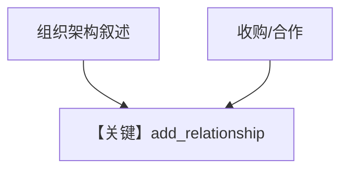

# 02_entity_relationships.py — 实现原理分析

<!-- cookbook-py-source:start -->
## 完整源码

```python
"""
Entity Memory: Relationships (Deep Dive)
========================================
Graph edges between entities.

Relationships connect entities to form a knowledge graph:
- "Bob is CTO of Acme"
- "Acme acquired StartupX"
- "API Gateway depends on Auth Service"

AGENTIC mode lets the agent create entities and add relationships.

Compare with: 01_facts_and_events.py for facts/events.
See also: 01_basics/5b_entity_memory_agentic.py for the basics.
"""

from agno.agent import Agent
from agno.db.postgres import PostgresDb
from agno.learn import EntityMemoryConfig, LearningMachine, LearningMode
from agno.models.openai import OpenAIResponses

# ---------------------------------------------------------------------------
# Create Agent
# ---------------------------------------------------------------------------

db = PostgresDb(db_url="postgresql+psycopg://ai:ai@localhost:5532/ai")

agent = Agent(
    model=OpenAIResponses(id="gpt-5.2"),
    db=db,
    instructions=(
        "Build a knowledge graph of entities and their relationships. "
        "Use appropriate relation types: works_at, reports_to, acquired, depends_on, etc."
    ),
    learning=LearningMachine(
        entity_memory=EntityMemoryConfig(
            mode=LearningMode.AGENTIC,
        ),
    ),
    markdown=True,
)

# ---------------------------------------------------------------------------
# Run Demo
# ---------------------------------------------------------------------------

if __name__ == "__main__":
    from rich.pretty import pprint

    user_id = "org@example.com"
    session_id = "org_session"

    # Define org structure
    print("\n" + "=" * 60)
    print("MESSAGE 1: Define org structure")
    print("=" * 60 + "\n")

    agent.print_response(
        "TechCorp's leadership: "
        "Sarah Chen is the CEO and founder. "
        "Bob Martinez is the CTO, reporting to Sarah. "
        "Alice Kim leads Engineering under Bob. "
        "DevOps and Backend teams report to Alice.",
        user_id=user_id,
        session_id=session_id,
        stream=True,
    )
    print("\n--- Entities ---")
    pprint(
        agent.learning_machine.entity_memory_store.search(query="techcorp", limit=10)
    )

    # Query relationships
    print("\n" + "=" * 60)
    print("MESSAGE 2: Query relationships")
    print("=" * 60 + "\n")

    agent.print_response(
        "Who reports to Bob Martinez?",
        user_id=user_id,
        session_id="session_2",
        stream=True,
    )

    # Add more relationships
    print("\n" + "=" * 60)
    print("MESSAGE 3: Company relationships")
    print("=" * 60 + "\n")

    agent.print_response(
        "TechCorp just acquired StartupAI for $50M. "
        "They also partnered with CloudCo on infrastructure.",
        user_id=user_id,
        session_id="session_3",
        stream=True,
    )
    print("\n--- Updated Entities ---")
    pprint(
        agent.learning_machine.entity_memory_store.search(query="techcorp", limit=10)
    )
```

<!-- cookbook-py-source:end -->

> 源文件：`cookbook/08_learning/04_entity_memory/02_entity_relationships.py`

## 概述

本示例聚焦 **实体间关系**（汇报线、收购、合作等），`instructions` 要求使用 `works_at`、`reports_to` 等关系类型构建知识图谱。

**核心配置一览：**

| 配置项 | 值 | 说明 |
|--------|------|------|
| `instructions` | 见下 | 关系类型与图谱目标 |
| `learning` | `EntityMemoryConfig(mode=AGENTIC)` | 默认 namespace |

### 还原后的 instructions

```text
Build a knowledge graph of entities and their relationships. Use appropriate relation types: works_at, reports_to, acquired, depends_on, etc.
```

## 完整 API 请求

```python
client.responses.create(model="gpt-5.2", input=[...], tools=[...])
```

## Mermaid 流程图



## 关键源码文件索引

| 文件 | 作用 |
|------|------|
| entity memory | relationship 边 |
