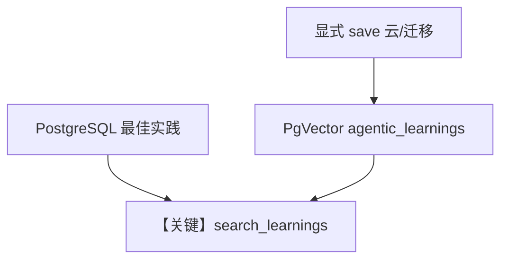

# 01_agentic_mode.py — 实现原理分析

<!-- cookbook-py-source:start -->
## 完整源码

```python
"""
Learned Knowledge: Agentic Mode (Deep Dive)
===========================================
Agent decides when to save and retrieve learnings.

AGENTIC mode gives the agent tools:
- save_learning: Store reusable insights
- search_learnings: Find relevant prior knowledge

The agent decides what's worth remembering.

Compare with: 02_propose_mode.py for human-reviewed learnings.
See also: 01_basics/4_learned_knowledge.py for the basics.
"""

from agno.agent import Agent
from agno.db.postgres import PostgresDb
from agno.knowledge import Knowledge
from agno.knowledge.embedder.openai import OpenAIEmbedder
from agno.learn import LearnedKnowledgeConfig, LearningMachine, LearningMode
from agno.models.openai import OpenAIResponses
from agno.vectordb.pgvector import PgVector, SearchType

# ---------------------------------------------------------------------------
# Create Agent
# ---------------------------------------------------------------------------

db_url = "postgresql+psycopg://ai:ai@localhost:5532/ai"
db = PostgresDb(db_url=db_url)

knowledge = Knowledge(
    vector_db=PgVector(
        db_url=db_url,
        table_name="agentic_learnings",
        search_type=SearchType.hybrid,
        embedder=OpenAIEmbedder(id="text-embedding-3-small"),
    ),
)

agent = Agent(
    model=OpenAIResponses(id="gpt-5.2"),
    db=db,
    instructions=(
        "You learn from interactions. "
        "Use save_learning to store valuable, reusable insights. "
        "Use search_learnings to find and apply prior knowledge."
    ),
    learning=LearningMachine(
        knowledge=knowledge,
        learned_knowledge=LearnedKnowledgeConfig(
            mode=LearningMode.AGENTIC,
        ),
    ),
    markdown=True,
)

# ---------------------------------------------------------------------------
# Run Demo
# ---------------------------------------------------------------------------

if __name__ == "__main__":
    user_id = "learn@example.com"

    # Save a learning
    print("\n" + "=" * 60)
    print("MESSAGE 1: Save a learning")
    print("=" * 60 + "\n")

    agent.print_response(
        "Save this insight: When comparing cloud providers, always check "
        "egress costs first - they can vary by 10x between providers.",
        user_id=user_id,
        session_id="session_1",
        stream=True,
    )
    agent.learning_machine.learned_knowledge_store.print(query="cloud egress")

    # Save another learning
    print("\n" + "=" * 60)
    print("MESSAGE 2: Save another learning")
    print("=" * 60 + "\n")

    agent.print_response(
        "Save this: For database migrations, always test rollback "
        "procedures in staging before running in production.",
        user_id=user_id,
        session_id="session_2",
        stream=True,
    )
    agent.learning_machine.learned_knowledge_store.print(query="database migration")

    # Apply learnings
    print("\n" + "=" * 60)
    print("MESSAGE 3: Apply learnings to new question")
    print("=" * 60 + "\n")

    agent.print_response(
        "I'm setting up a new project with PostgreSQL on AWS. "
        "What best practices should I follow?",
        user_id=user_id,
        session_id="session_3",
        stream=True,
    )
```

<!-- cookbook-py-source:end -->

> 源文件：`cookbook/08_learning/05_learned_knowledge/01_agentic_mode.py`

## 概述

本示例为 **Learned Knowledge AGENTIC** 深入版：`PgVector` 表名 `agentic_learnings`，`instructions` 强调 `save_learning` / `search_learnings` 的配合，并演示多条见解保存后的综合问答。

**核心配置一览：**

| 配置项 | 值 | 说明 |
|--------|------|------|
| `instructions` | 见下 | 学习策略 |
| `knowledge` | `Knowledge` + `PgVector(table_name="agentic_learnings", ...)` | 混合检索 |
| `learned_knowledge` | `LearnedKnowledgeConfig(mode=AGENTIC)` | — |

### 还原后的 instructions

```text
You learn from interactions. Use save_learning to store valuable, reusable insights. Use search_learnings to find and apply prior knowledge.
```

另含 `LearnedKnowledgeStore` 固定 AGENTIC 规则全文（见 `learned_knowledge.py`）与 `# 3.3.12`。

## 完整 API 请求

```python
client.responses.create(model="gpt-5.2", input=[...], tools=[...])
```

## Mermaid 流程图



## 关键源码文件索引

| 文件 | 作用 |
|------|------|
| `agno/learn/stores/learned_knowledge.py` | AGENTIC 规则 |
| `agno/vectordb/pgvector` | 向量表 |
