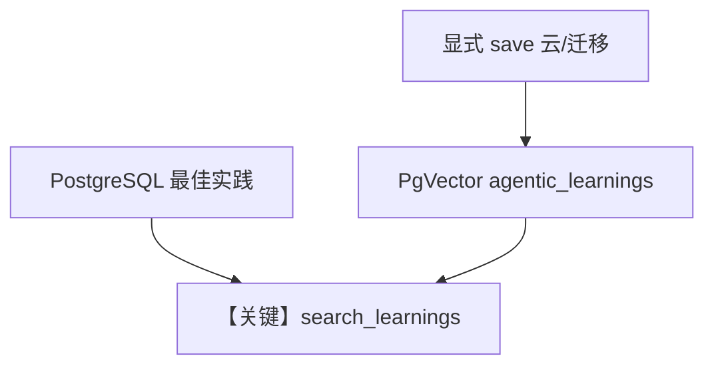

# 01_agentic_mode.py — 实现原理分析

> 源文件：`cookbook/08_learning/05_learned_knowledge/01_agentic_mode.py`

## 概述

本示例为 **Learned Knowledge AGENTIC** 深入版：`PgVector` 表名 `agentic_learnings`，`instructions` 强调 `save_learning` / `search_learnings` 的配合，并演示多条见解保存后的综合问答。

**核心配置一览：**

| 配置项 | 值 | 说明 |
|--------|------|------|
| `instructions` | 见下 | 学习策略 |
| `knowledge` | `Knowledge` + `PgVector(table_name="agentic_learnings", ...)` | 混合检索 |
| `learned_knowledge` | `LearnedKnowledgeConfig(mode=AGENTIC)` | — |

### 还原后的 instructions

```text
You learn from interactions. Use save_learning to store valuable, reusable insights. Use search_learnings to find and apply prior knowledge.
```

另含 `LearnedKnowledgeStore` 固定 AGENTIC 规则全文（见 `learned_knowledge.py`）与 `# 3.3.12`。

## 完整 API 请求

```python
client.responses.create(model="gpt-5.2", input=[...], tools=[...])
```

## Mermaid 流程图



## 关键源码文件索引

| 文件 | 作用 |
|------|------|
| `agno/learn/stores/learned_knowledge.py` | AGENTIC 规则 |
| `agno/vectordb/pgvector` | 向量表 |
