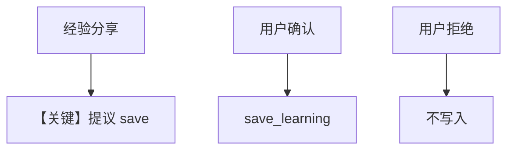

# 02_propose_mode.py — 实现原理分析

> 源文件：`cookbook/08_learning/05_learned_knowledge/02_propose_mode.py`

## 概述

本示例展示 **`LearnedKnowledgeConfig(mode=PROPOSE)`**：模型先提议保存，用户确认后再 `save_learning`，并演示拒绝保存的场景；向量表 `propose_learnings`。

**核心配置一览：**

| 配置项 | 值 | 说明 |
|--------|------|------|
| `instructions` | 提议保存并等待确认后再 save | HITL 质量控制 |
| `learned_knowledge` | `LearningMode.PROPOSE` | 提议模式 |
| `knowledge` | `PgVector(table_name="propose_learnings")` | 混合检索 |

### 还原后的 instructions

```text
When you discover a valuable insight, propose saving it. Wait for user confirmation before using save_learning.
```

## 核心组件解析

`LearnedKnowledgeStore` 在 PROPOSE 下 `build_context` 与 AGENTIC 不同（见 `learned_knowledge.py` 中 `_build_propose_mode_context`）；`requires_history` 等逻辑支持多轮确认。

### 运行机制与因果链

第二轮用户「Yes, please save that」触发确认路径；第三轮拒绝保存则不应把无价值内容写入向量库。

## 完整 API 请求

`OpenAIResponses`：`client.responses.create(...)`。

## Mermaid 流程图



## 关键源码文件索引

| 文件 | 作用 |
|------|------|
| `learned_knowledge.py` | `_build_propose_mode_context` |
