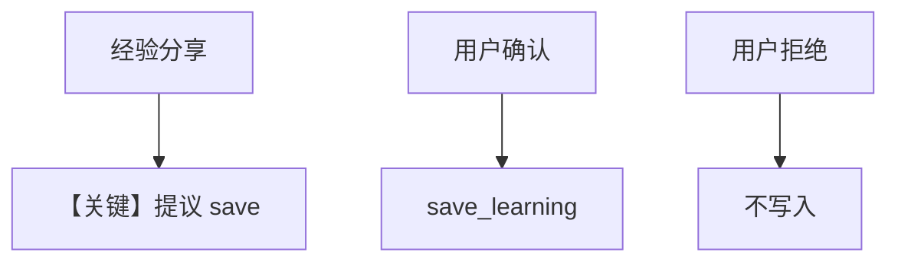

# 02_propose_mode.py — 实现原理分析

<!-- cookbook-py-source:start -->
## 完整源码

```python
"""
Learned Knowledge: Propose Mode (Deep Dive)
===========================================
Agent proposes learnings, user confirms before saving.

PROPOSE mode adds human quality control:
1. Agent identifies valuable insights
2. Agent proposes them to the user
3. User confirms before saving

Use when quality matters more than speed.

Compare with: 01_agentic_mode.py for automatic saving.
See also: 01_basics/4_learned_knowledge.py for the basics.
"""

from agno.agent import Agent
from agno.db.postgres import PostgresDb
from agno.knowledge import Knowledge
from agno.knowledge.embedder.openai import OpenAIEmbedder
from agno.learn import LearnedKnowledgeConfig, LearningMachine, LearningMode
from agno.models.openai import OpenAIResponses
from agno.vectordb.pgvector import PgVector, SearchType

# ---------------------------------------------------------------------------
# Create Agent
# ---------------------------------------------------------------------------

db_url = "postgresql+psycopg://ai:ai@localhost:5532/ai"
db = PostgresDb(db_url=db_url)

knowledge = Knowledge(
    vector_db=PgVector(
        db_url=db_url,
        table_name="propose_learnings",
        search_type=SearchType.hybrid,
        embedder=OpenAIEmbedder(id="text-embedding-3-small"),
    ),
)

agent = Agent(
    model=OpenAIResponses(id="gpt-5.2"),
    db=db,
    instructions=(
        "When you discover a valuable insight, propose saving it. "
        "Wait for user confirmation before using save_learning."
    ),
    learning=LearningMachine(
        knowledge=knowledge,
        learned_knowledge=LearnedKnowledgeConfig(
            mode=LearningMode.PROPOSE,
        ),
    ),
    markdown=True,
)

# ---------------------------------------------------------------------------
# Run Demo
# ---------------------------------------------------------------------------

if __name__ == "__main__":
    user_id = "propose@example.com"
    session_id = "propose_session"

    # User shares experience
    print("\n" + "=" * 60)
    print("MESSAGE 1: User shares experience")
    print("=" * 60 + "\n")

    agent.print_response(
        "I just spent 2 hours debugging why my Docker container couldn't "
        "connect to localhost. Turns out you need to use host.docker.internal "
        "on Mac to access the host machine from inside a container.",
        user_id=user_id,
        session_id=session_id,
        stream=True,
    )
    # Agent should propose saving this

    # User confirms
    print("\n" + "=" * 60)
    print("MESSAGE 2: User confirms")
    print("=" * 60 + "\n")

    agent.print_response(
        "Yes, please save that. It would be helpful.",
        user_id=user_id,
        session_id=session_id,
        stream=True,
    )
    agent.learning_machine.learned_knowledge_store.print(query="docker localhost")

    # Rejection example
    print("\n" + "=" * 60)
    print("MESSAGE 3: User shares, then rejects")
    print("=" * 60 + "\n")

    agent.print_response(
        "I fixed my bug by restarting my computer.",
        user_id=user_id,
        session_id="session_2",
        stream=True,
    )

    agent.print_response(
        "No, don't save that. It's not generally useful.",
        user_id=user_id,
        session_id="session_2",
        stream=True,
    )
    agent.learning_machine.learned_knowledge_store.print(query="restart")
```

<!-- cookbook-py-source:end -->

> 源文件：`cookbook/08_learning/05_learned_knowledge/02_propose_mode.py`

## 概述

本示例展示 **`LearnedKnowledgeConfig(mode=PROPOSE)`**：模型先提议保存，用户确认后再 `save_learning`，并演示拒绝保存的场景；向量表 `propose_learnings`。

**核心配置一览：**

| 配置项 | 值 | 说明 |
|--------|------|------|
| `instructions` | 提议保存并等待确认后再 save | HITL 质量控制 |
| `learned_knowledge` | `LearningMode.PROPOSE` | 提议模式 |
| `knowledge` | `PgVector(table_name="propose_learnings")` | 混合检索 |

### 还原后的 instructions

```text
When you discover a valuable insight, propose saving it. Wait for user confirmation before using save_learning.
```

## 核心组件解析

`LearnedKnowledgeStore` 在 PROPOSE 下 `build_context` 与 AGENTIC 不同（见 `learned_knowledge.py` 中 `_build_propose_mode_context`）；`requires_history` 等逻辑支持多轮确认。

### 运行机制与因果链

第二轮用户「Yes, please save that」触发确认路径；第三轮拒绝保存则不应把无价值内容写入向量库。

## 完整 API 请求

`OpenAIResponses`：`client.responses.create(...)`。

## Mermaid 流程图



## 关键源码文件索引

| 文件 | 作用 |
|------|------|
| `learned_knowledge.py` | `_build_propose_mode_context` |
