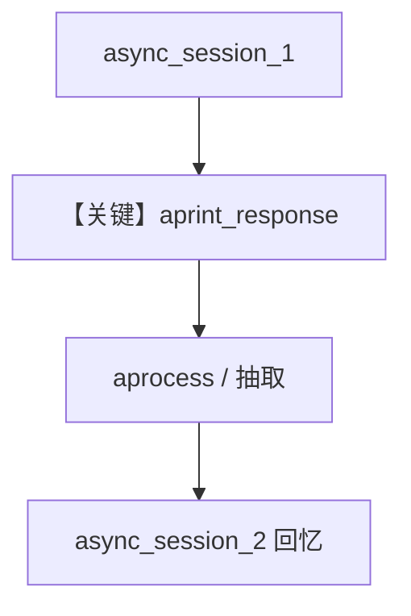

# 01_async_user_profile.py — 实现原理分析

> 源文件：`cookbook/08_learning/06_quick_tests/01_async_user_profile.py`

## 概述

本示例验证 **异步路径 `aprint_response`** 与用户画像 ALWAYS 学习协同：异步运行时后台学习与 `aprocess`/`process` 分支需与同步一致。

**核心配置一览：**

| 配置项 | 值 | 说明 |
|--------|------|------|
| `learning` | `UserProfileConfig(mode=ALWAYS)` | 同同步 cookbook |
| `model` | `OpenAIResponses(id="gpt-5.2")` | — |
| `db` | `PostgresDb` | — |

## 核心组件解析

`asyncio.run(main())` 驱动两轮 `aprint_response`；测试关注竞态与 `learning_machine` 初始化时机。

### 运行机制与因果链

首次 `aprint_response` 后 `learning_machine` 应非空且 `user_profile_store` 可用。

## System Prompt 组装

无自定义 instructions；与同步 profile 示例相同的默认拼装 + `# 3.3.12`。

## 完整 API 请求

异步：`await agent.aprint_response` → 内部 `ainvoke` / `responses` 异步客户端。

## Mermaid 流程图

## 关键源码文件索引

| 文件 | 作用 |
|------|------|
| `agno/agent/agent.py` | `aprint_response` / async run |
