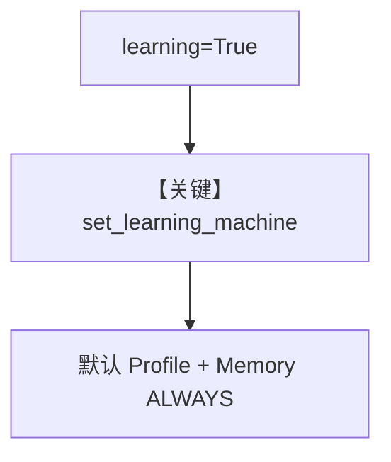

# 02_learning_true_shorthand.py — 实现原理分析

<!-- cookbook-py-source:start -->
## 完整源码

```python
"""
Learning=True Shorthand Test
============================
Tests the simplest way to enable learning: `learning=True`.

This is the most common user pattern and must work flawlessly.

When learning=True:
- A default LearningMachine is created
- UserProfile is enabled with ALWAYS mode (structured fields)
- UserMemory is enabled with ALWAYS mode (unstructured observations)
- db and model are injected from the agent

This test verifies the shorthand works identically to explicit config.
"""

from agno.agent import Agent
from agno.db.postgres import PostgresDb
from agno.models.openai import OpenAIResponses

# ---------------------------------------------------------------------------
# Create Agent - Using the simplest possible configuration
# ---------------------------------------------------------------------------

db = PostgresDb(db_url="postgresql+psycopg://ai:ai@localhost:5532/ai")

# This is the simplest way to enable learning - just set learning=True
agent = Agent(
    model=OpenAIResponses(id="gpt-5.2"),
    db=db,
    learning=True,  # <-- The shorthand we're testing
    markdown=True,
)

# ---------------------------------------------------------------------------
# Run Demo
# ---------------------------------------------------------------------------

if __name__ == "__main__":
    user_id = "shorthand_test@example.com"

    # Note: LearningMachine is lazily initialized - only set up when agent runs
    print("\n" + "=" * 60)
    print("SESSION 1: Share information (learning=True shorthand)")
    print("=" * 60 + "\n")

    agent.print_response(
        "Hi! I'm Charlie Brown. Friends call me Chuck.",
        user_id=user_id,
        session_id="shorthand_session_1",
        stream=True,
    )

    # Verify LearningMachine was created (after first run)
    print("\n" + "=" * 60)
    print("VERIFICATION: LearningMachine created from learning=True")
    print("=" * 60 + "\n")

    lm = agent.learning_machine
    print(f"LearningMachine exists: {lm is not None}")
    print(
        f"UserProfileStore exists: {lm.user_profile_store is not None if lm else False}"
    )
    print(
        f"UserMemoryStore exists: {lm.user_memory_store is not None if lm else False}"
    )
    print(f"DB injected: {lm.db is not None if lm else False}")
    print(f"Model injected: {lm.model is not None if lm else False}")

    if not lm:
        print("\nFAILED: LearningMachine was not created!")
        exit(1)

    if not lm.user_profile_store:
        print("\nFAILED: UserProfileStore was not created!")
        exit(1)

    if not lm.user_memory_store:
        print("\nFAILED: UserMemoryStore was not created!")
        exit(1)

    print("\n--- User Profile ---")
    lm.user_profile_store.print(user_id=user_id)

    print("\n--- User Memory ---")
    lm.user_memory_store.print(user_id=user_id)

    # Session 2: Verify profile persisted
    print("\n" + "=" * 60)
    print("SESSION 2: Profile recall")
    print("=" * 60 + "\n")

    agent.print_response(
        "What do my friends call me?",
        user_id=user_id,
        session_id="shorthand_session_2",
        stream=True,
    )

    print("\n--- User Profile ---")
    lm.user_profile_store.print(user_id=user_id)

    print("\n--- User Memory ---")
    lm.user_memory_store.print(user_id=user_id)

    print("\n" + "=" * 60)
    print("SHORTHAND TEST COMPLETE")
    print("=" * 60)
```

<!-- cookbook-py-source:end -->

> 源文件：`cookbook/08_learning/06_quick_tests/02_learning_true_shorthand.py`

## 概述

本示例验证 **`learning=True` 简写** 与显式 `LearningMachine` 等价：默认启用 UserProfile + UserMemory 的 ALWAYS，并从 Agent 注入 `db` 与 `model`。

**核心配置一览：**

| 配置项 | 值 | 说明 |
|--------|------|------|
| `learning` | `True` | 简写 |
| `db` / `model` | `PostgresDb`、`OpenAIResponses` | 注入到 LearningMachine |

## 核心组件解析

脚本在首轮 run 后断言 `lm.user_profile_store`、`lm.user_memory_store`、`lm.db`、`lm.model` 均存在。

### 运行机制与因果链

`learning_machine` 懒加载：注释写明仅在 agent 运行后初始化（`agent.py` `learning_machine` property）。

## System Prompt 组装

同 `01_always_learn`：无 instructions，仅 markdown 附加块 + `# 3.3.12`。

## 完整 API 请求

```python
client.responses.create(model="gpt-5.2", input=[...])
```

## Mermaid 流程图



## 关键源码文件索引

| 文件 | 作用 |
|------|------|
| `agno/agent/_init.py` | `set_learning_machine` |
