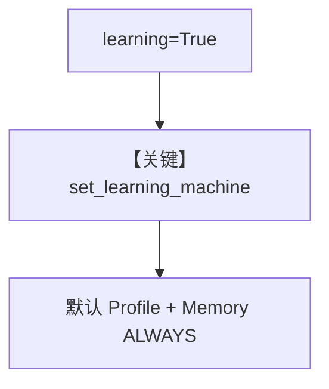

# 02_learning_true_shorthand.py — 实现原理分析

> 源文件：`cookbook/08_learning/06_quick_tests/02_learning_true_shorthand.py`

## 概述

本示例验证 **`learning=True` 简写** 与显式 `LearningMachine` 等价：默认启用 UserProfile + UserMemory 的 ALWAYS，并从 Agent 注入 `db` 与 `model`。

**核心配置一览：**

| 配置项 | 值 | 说明 |
|--------|------|------|
| `learning` | `True` | 简写 |
| `db` / `model` | `PostgresDb`、`OpenAIResponses` | 注入到 LearningMachine |

## 核心组件解析

脚本在首轮 run 后断言 `lm.user_profile_store`、`lm.user_memory_store`、`lm.db`、`lm.model` 均存在。

### 运行机制与因果链

`learning_machine` 懒加载：注释写明仅在 agent 运行后初始化（`agent.py` `learning_machine` property）。

## System Prompt 组装

同 `01_always_learn`：无 instructions，仅 markdown 附加块 + `# 3.3.12`。

## 完整 API 请求

```python
client.responses.create(model="gpt-5.2", input=[...])
```

## Mermaid 流程图



## 关键源码文件索引

| 文件 | 作用 |
|------|------|
| `agno/agent/_init.py` | `set_learning_machine` |
