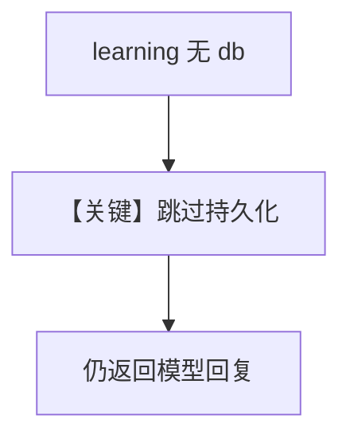

# 03_no_db_graceful.py — 实现原理分析

> 源文件：`cookbook/08_learning/06_quick_tests/03_no_db_graceful.py`

## 概述

本示例验证 **无 `db` 时启用学习** 的降级：`Agent` 仍应答，不崩溃，持久化与画像为空或跳过。

**核心配置一览：**

| 配置项 | 值 | 说明 |
|--------|------|------|
| `db` | **未传入** | 边界条件 |
| `learning` | `LearningMachine(user_profile=UserProfileConfig(ALWAYS))` | 需要持久化时通常应配 db |

## 核心组件解析

`learning_machine` 仍可存在但 `lm.db is None`；`print_response` 不应抛异常。

### 运行机制与因果链

设计目标：配置失误时**优雅降级**而非硬失败；与 `_learning_init_attempted` 等守卫逻辑相关（见 `agent.py`）。

## System Prompt 组装

与有 DB 时一致框架；若无持久化，`build_context` 中画像可能为空。

## 完整 API 请求

```python
client.responses.create(model="gpt-5.2", input=[...])
```

## Mermaid 流程图



## 关键源码文件索引

| 文件 | 作用 |
|------|------|
| `agno/agent/_init.py` | `set_learning_machine` 与 db 检查 |
