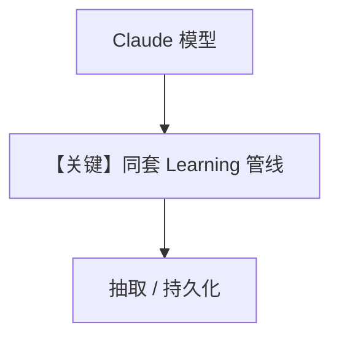

# 04_claude_model.py — 实现原理分析

> 源文件：`cookbook/08_learning/06_quick_tests/04_claude_model.py`

## 概述

本示例验证 **学习管线与模型无关**：将 `OpenAIResponses` 换为 **`Claude(id="claude-sonnet-4-5")`**，用户画像 ALWAYS 仍应工作；注释提醒 Claude 工具格式与结构化输出差异。

**核心配置一览：**

| 配置项 | 值 | 说明 |
|--------|------|------|
| `model` | `Claude(id="claude-sonnet-4-5")` | Anthropic Messages API 路径 |
| `learning` | `UserProfileConfig(mode=ALWAYS)` | — |

## 核心组件解析

抽取依赖模型与解析器；若 Claude 某版本不支持所需 structured output，脚本打印 WARNING。

## 完整 API 请求

需查阅 `agno/models/anthropic` 中 `Claude.invoke`：通常为 Messages API（非 `responses.create`）。

```python
# 形态以 agno/models/anthropic 实现为准
# messages.create(...) 或等价 async
```

## Mermaid 流程图



## 关键源码文件索引

| 文件 | 作用 |
|------|------|
| `agno/models/anthropic/` | Claude 适配器 |
