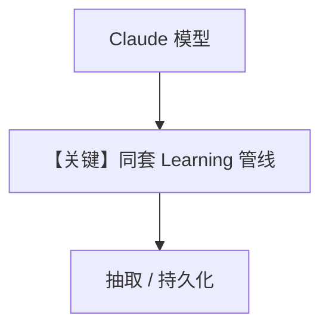

# 04_claude_model.py — 实现原理分析

<!-- cookbook-py-source:start -->
## 完整源码

```python
"""
Claude Model Test
=================
Tests learning with Claude instead of OpenAI.

All other cookbooks use OpenAI (gpt-5.2). This test verifies that
learning works with Claude models, ensuring the implementation is
model-agnostic.

Key things to verify:
1. Profile extraction works with Claude
2. Tool calls work correctly (Claude uses different tool format)
3. Background extraction completes successfully
"""

from agno.agent import Agent
from agno.db.postgres import PostgresDb
from agno.learn import LearningMachine, LearningMode, UserProfileConfig
from agno.models.anthropic import Claude

# ---------------------------------------------------------------------------
# Create Agent - Using Claude instead of OpenAI
# ---------------------------------------------------------------------------

db = PostgresDb(db_url="postgresql+psycopg://ai:ai@localhost:5532/ai")

agent = Agent(
    model=Claude(id="claude-sonnet-4-5"),  # Using Claude
    db=db,
    learning=LearningMachine(
        user_profile=UserProfileConfig(
            mode=LearningMode.ALWAYS,
        ),
    ),
    markdown=True,
)

# ---------------------------------------------------------------------------
# Run Demo
# ---------------------------------------------------------------------------

if __name__ == "__main__":
    user_id = "claude_test@example.com"

    print("\n" + "=" * 60)
    print("TEST: Learning with Claude model")
    print("=" * 60 + "\n")

    print(f"Model type: {type(agent.model).__name__}")

    # Session 1: Share information
    print("\n" + "=" * 60)
    print("SESSION 1: Share information (Claude extraction)")
    print("=" * 60 + "\n")

    agent.print_response(
        "Hi! I'm Bruce Wayne, but my friends call me Batman.",
        user_id=user_id,
        session_id="claude_session_1",
        stream=True,
    )

    # Check if LearningMachine was initialized
    lm = agent.learning_machine
    print(f"\nLearningMachine exists: {lm is not None}")

    if lm and lm.user_profile_store:
        lm.user_profile_store.print(user_id=user_id)
    else:
        print("\n[WARNING] UserProfileStore not available - extraction may have failed")
        print(
            "Note: Some Claude models may not support structured outputs required for extraction"
        )

    # Session 2: Verify profile persisted
    print("\n" + "=" * 60)
    print("SESSION 2: Profile recall (Claude)")
    print("=" * 60 + "\n")

    agent.print_response(
        "What's my secret identity?",
        user_id=user_id,
        session_id="claude_session_2",
        stream=True,
    )

    if lm and lm.user_profile_store:
        lm.user_profile_store.print(user_id=user_id)

    print("\n" + "=" * 60)
    print("CLAUDE MODEL TEST COMPLETE")
    print("=" * 60)
```

<!-- cookbook-py-source:end -->

> 源文件：`cookbook/08_learning/06_quick_tests/04_claude_model.py`

## 概述

本示例验证 **学习管线与模型无关**：将 `OpenAIResponses` 换为 **`Claude(id="claude-sonnet-4-5")`**，用户画像 ALWAYS 仍应工作；注释提醒 Claude 工具格式与结构化输出差异。

**核心配置一览：**

| 配置项 | 值 | 说明 |
|--------|------|------|
| `model` | `Claude(id="claude-sonnet-4-5")` | Anthropic Messages API 路径 |
| `learning` | `UserProfileConfig(mode=ALWAYS)` | — |

## 核心组件解析

抽取依赖模型与解析器；若 Claude 某版本不支持所需 structured output，脚本打印 WARNING。

## 完整 API 请求

需查阅 `agno/models/anthropic` 中 `Claude.invoke`：通常为 Messages API（非 `responses.create`）。

```python
# 形态以 agno/models/anthropic 实现为准
# messages.create(...) 或等价 async
```

## Mermaid 流程图



## 关键源码文件索引

| 文件 | 作用 |
|------|------|
| `agno/models/anthropic/` | Claude 适配器 |
