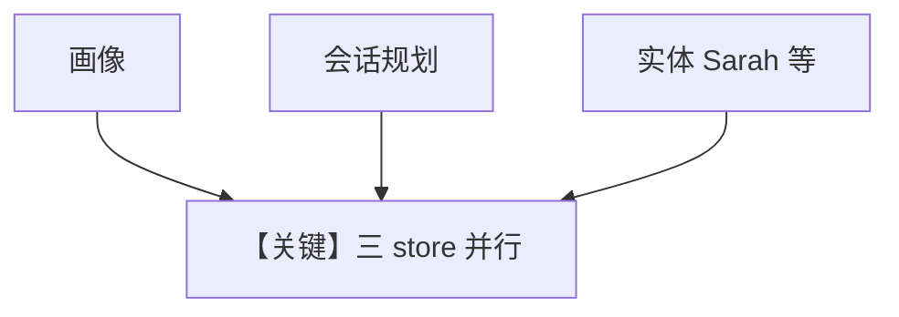

# personal_assistant.py — 实现原理分析

> 源文件：`cookbook/08_learning/07_patterns/personal_assistant.py`

## 概述

本示例组合 **UserProfile ALWAYS + SessionContext planning + EntityMemory ALWAYS（按 user 命名空间）**，并在 Agent 上设置 **`user_id`/`session_id` 默认**，演示私人助理模式。

**核心配置一览：**

| 配置项 | 值 | 说明 |
|--------|------|------|
| `instructions` | 私人助理、记住偏好、跟踪人物事件 | 角色 |
| `learning` | `UserProfileConfig(ALWAYS)` + `SessionContextConfig(enable_planning=True)` + `EntityMemoryConfig(ALWAYS, namespace=f"user:{user_id}:personal")` | 三合一 |
| `user_id` / `session_id` | 构造 `create_personal_assistant` 时传入 Agent | 默认值 |

### 还原后的 instructions

```text
You are a helpful personal assistant. Remember user preferences without being asked. Keep track of important people and events in their life.
```

## 核心组件解析

每轮 `create_personal_assistant` 新建 Agent 但共享 `db` 与同一 `user_id`；`entity_memory` 的 namespace 随 `user_id` 隔离。

## 完整 API 请求

`OpenAIResponses` → `responses.create`。

## Mermaid 流程图



## 关键源码文件索引

| 文件 | 作用 |
|------|------|
| `LearningMachine` | 多 store 组合 |
