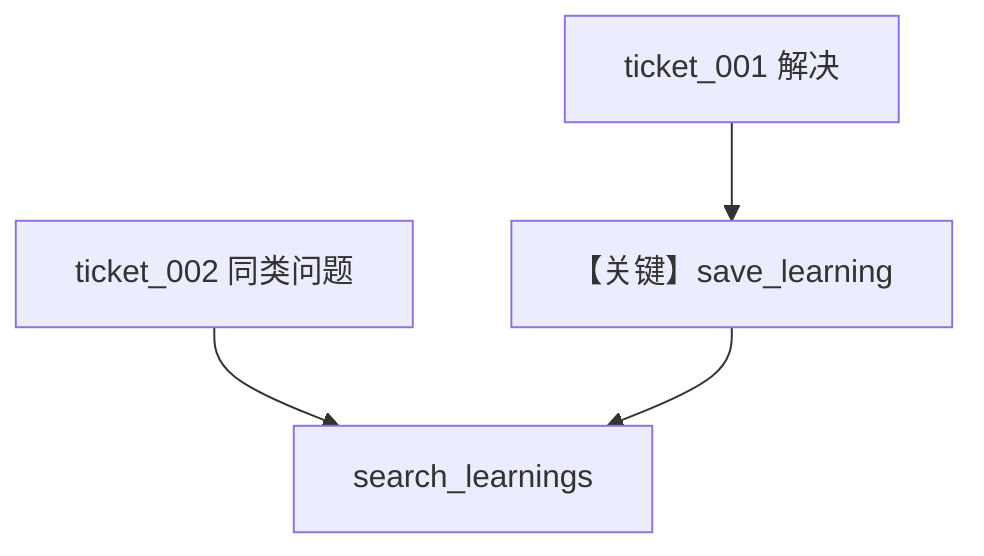

# support_agent.py — 实现原理分析

<!-- cookbook-py-source:start -->
## 完整源码

```python
"""
Pattern: Support Agent with Learning
====================================
A customer support agent that learns from interactions.

This pattern combines:
- User Profile: Customer history and preferences
- Session Context: Current ticket/issue tracking
- Entity Memory: Products, past tickets (shared across org)
- Learned Knowledge: Solutions and troubleshooting patterns (shared)

The agent gets faster at resolving issues by learning from successes.

See also: 01_basics/ for individual store examples.
"""

from agno.agent import Agent
from agno.db.postgres import PostgresDb
from agno.knowledge import Knowledge
from agno.knowledge.embedder.openai import OpenAIEmbedder
from agno.learn import (
    EntityMemoryConfig,
    LearnedKnowledgeConfig,
    LearningMachine,
    LearningMode,
    SessionContextConfig,
    UserProfileConfig,
)
from agno.models.openai import OpenAIResponses
from agno.vectordb.pgvector import PgVector, SearchType

# ---------------------------------------------------------------------------
# Create Agent
# ---------------------------------------------------------------------------

db_url = "postgresql+psycopg://ai:ai@localhost:5532/ai"
db = PostgresDb(db_url=db_url)

# Shared knowledge base for solutions
knowledge = Knowledge(
    vector_db=PgVector(
        db_url=db_url,
        table_name="support_kb",
        search_type=SearchType.hybrid,
        embedder=OpenAIEmbedder(id="text-embedding-3-small"),
    ),
)


def create_support_agent(customer_id: str, ticket_id: str, org_id: str) -> Agent:
    """Create a support agent for a specific ticket."""
    return Agent(
        model=OpenAIResponses(id="gpt-5.2"),
        db=db,
        instructions=(
            "You are a helpful support agent. "
            "Check if similar issues have been solved before. "
            "Save successful solutions for future reference."
        ),
        learning=LearningMachine(
            knowledge=knowledge,
            user_profile=UserProfileConfig(
                mode=LearningMode.ALWAYS,
            ),
            session_context=SessionContextConfig(
                enable_planning=True,
            ),
            entity_memory=EntityMemoryConfig(
                mode=LearningMode.ALWAYS,
                namespace=f"org:{org_id}:support",
            ),
            learned_knowledge=LearnedKnowledgeConfig(
                mode=LearningMode.AGENTIC,
            ),
        ),
        user_id=customer_id,
        session_id=ticket_id,
        markdown=True,
    )


# ---------------------------------------------------------------------------
# Run Demo
# ---------------------------------------------------------------------------

if __name__ == "__main__":
    org_id = "acme"

    # Ticket 1: First customer with login issue
    print("\n" + "=" * 60)
    print("TICKET 1: First login issue")
    print("=" * 60 + "\n")

    agent = create_support_agent("customer_1@example.com", "ticket_001", org_id)
    agent.print_response(
        "I can't log into my account. It says 'invalid credentials' "
        "even though I know my password is correct. I'm using Chrome.",
        stream=True,
    )

    # Agent suggests solution
    print("\n" + "=" * 60)
    print("TICKET 1: Solution worked")
    print("=" * 60 + "\n")

    agent.print_response(
        "Clearing the cache worked! Thanks so much!",
        stream=True,
    )
    agent.learning_machine.learned_knowledge_store.print(query="login chrome cache")

    # Ticket 2: Second customer with similar issue
    print("\n" + "=" * 60)
    print("TICKET 2: Similar issue (should find prior solution)")
    print("=" * 60 + "\n")

    agent2 = create_support_agent("customer_2@example.com", "ticket_002", org_id)
    agent2.print_response(
        "Login not working in Chrome, says wrong password but I'm sure it's right.",
        stream=True,
    )

    # The agent should find and apply the previous solution
```

<!-- cookbook-py-source:end -->

> 源文件：`cookbook/08_learning/07_patterns/support_agent.py`

## 概述

本示例组合 **客户画像 + 会话规划 + 实体记忆（org 命名空间）+ Learned Knowledge AGENTIC + PgVector `support_kb`**，演示工单型支持代理跨客户复用解决方案。

**核心配置一览：**

| 配置项 | 值 | 说明 |
|--------|------|------|
| `instructions` | 支持代理、查历史方案、保存成功解法 | — |
| `knowledge` | `PgVector(table_name="support_kb")` | 共享向量库 |
| `learned_knowledge` | `AGENTIC` | 工具保存/检索 |
| `entity_memory` | `ALWAYS`, `namespace=f"org:{org_id}:support"` | 组织级共享 |
| `user_id`/`session_id` | `customer_id`/`ticket_id` | 工单维度 |

### 还原后的 instructions

```text
You are a helpful support agent. Check if similar issues have been solved before. Save successful solutions for future reference.
```

## 核心组件解析

第二张工单应通过 `search_learnings` 命中第一张沉淀的登录/缓存类解法。

## 完整 API 请求

```python
client.responses.create(model="gpt-5.2", input=[...], tools=[...])
```

## Mermaid 流程图



## 关键源码文件索引

| 文件 | 作用 |
|------|------|
| `learned_knowledge.py` | AGENTIC 规则 |
| `PgVector` | `support_kb` 表 |
