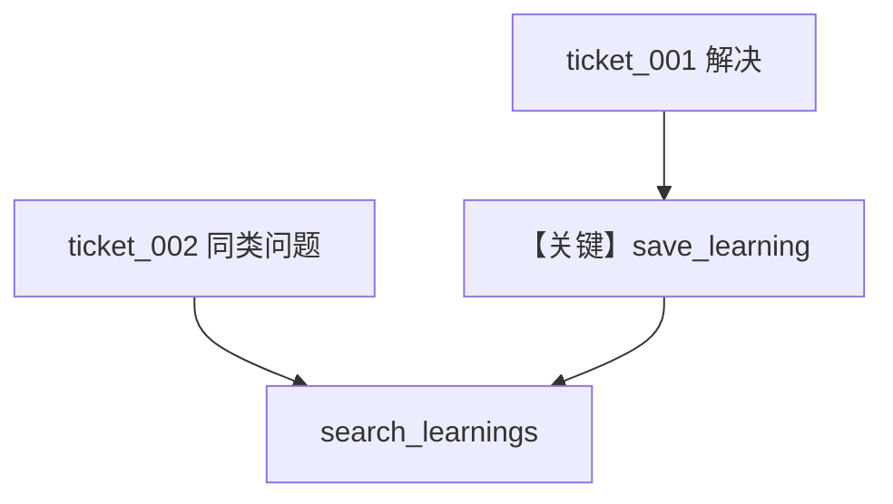

# support_agent.py — 实现原理分析

> 源文件：`cookbook/08_learning/07_patterns/support_agent.py`

## 概述

本示例组合 **客户画像 + 会话规划 + 实体记忆（org 命名空间）+ Learned Knowledge AGENTIC + PgVector `support_kb`**，演示工单型支持代理跨客户复用解决方案。

**核心配置一览：**

| 配置项 | 值 | 说明 |
|--------|------|------|
| `instructions` | 支持代理、查历史方案、保存成功解法 | — |
| `knowledge` | `PgVector(table_name="support_kb")` | 共享向量库 |
| `learned_knowledge` | `AGENTIC` | 工具保存/检索 |
| `entity_memory` | `ALWAYS`, `namespace=f"org:{org_id}:support"` | 组织级共享 |
| `user_id`/`session_id` | `customer_id`/`ticket_id` | 工单维度 |

### 还原后的 instructions

```text
You are a helpful support agent. Check if similar issues have been solved before. Save successful solutions for future reference.
```

## 核心组件解析

第二张工单应通过 `search_learnings` 命中第一张沉淀的登录/缓存类解法。

## 完整 API 请求

```python
client.responses.create(model="gpt-5.2", input=[...], tools=[...])
```

## Mermaid 流程图



## 关键源码文件索引

| 文件 | 作用 |
|------|------|
| `learned_knowledge.py` | AGENTIC 规则 |
| `PgVector` | `support_kb` 表 |
