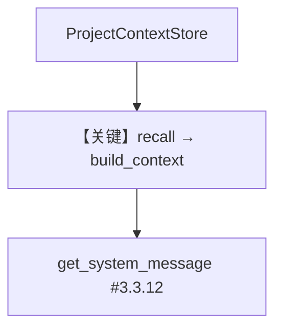

# 01_minimal_custom_store.py — 实现原理分析

> 源文件：`cookbook/08_learning/08_custom_stores/01_minimal_custom_store.py`

## 概述

本示例展示实现 **`LearningStore` 协议** 的最小自定义存储：`ProjectContextStore` 内存字典 + `LearningMachine(custom_stores={"project": ...})`，无 `db` 参数于 Agent。

**核心配置一览：**

| 配置项 | 值 | 说明 |
|--------|------|------|
| `learning` | `LearningMachine(custom_stores={...})` | 仅自定义 store |
| `model` | `OpenAIResponses` | — |
| `db` | 未设置 | 自定义内存存储 |

## 核心组件解析

必须实现：`learning_type`、`schema`、`recall`/`arecall`、`process`/`aprocess`、`build_context`、`get_tools`/`aget_tools` 等。`build_context` 返回 `<project_context>...</project_context>` 注入 system。

### 运行机制与因果链

`Machine.recall` 聚合各 store；`# 3.3.12` 调用 `_learning.build_context` 包含自定义段。

## System Prompt 组装

无 `instructions`；`# 3.3.12` 含 `<project_context>`（无数据时示例返回含 `Project: ... No context saved yet.` 的模板，见源码 `build_context`）。

## 完整 API 请求

```python
client.responses.create(model="gpt-5.2", input=[...])
```

## Mermaid 流程图



## 关键源码文件索引

| 文件 | 作用 |
|------|------|
| `agno/learn/stores/protocol.py` | `LearningStore` |
| `agno/learn/machine.py` | `custom_stores` 合并 |
