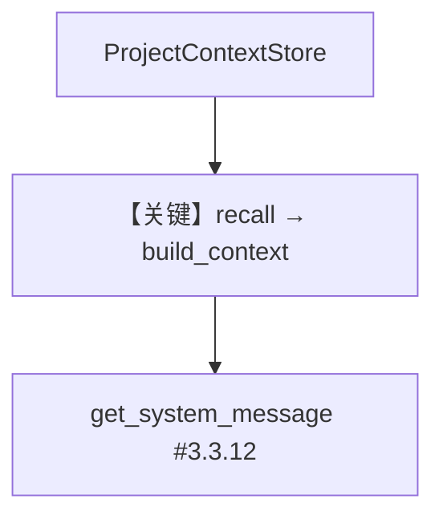

# 01_minimal_custom_store.py — 实现原理分析

<!-- cookbook-py-source:start -->
## 完整源码

```python
"""
Custom Store: Minimal Example
=============================
Shows how to create a custom learning store by implementing the LearningStore protocol.

This minimal example uses in-memory storage and demonstrates:
- The LearningStore protocol methods you must implement
- How to pass custom context (like project_id) via the store's constructor
- How to plug the custom store into LearningMachine

For a database-backed example, see 02_custom_store_with_db.py
"""

from dataclasses import dataclass, field
from typing import Any, Callable, Dict, List, Optional

from agno.agent import Agent
from agno.learn import LearningMachine
from agno.learn.stores.protocol import LearningStore
from agno.models.openai import OpenAIResponses

# ---------------------------------------------------------------------------
# Custom Store Implementation
# ---------------------------------------------------------------------------

# In-memory storage (would be a database in production)
_project_data: Dict[str, Dict[str, Any]] = {}


@dataclass
class ProjectContextStore(LearningStore):
    """Custom store for project-specific context.

    Stores information about projects the user is working on.
    Demonstrates how to create a custom learning store.

    Note: The `context` field is a pattern choice for this example, not a
    protocol requirement. You can also use typed config classes (like the
    built-in stores) or direct fields for specific parameters.
    """

    # Custom context passed at construction time (pattern choice, not required)
    context: Dict[str, Any] = field(default_factory=dict)

    # Internal state
    _updated: bool = field(default=False, init=False)

    # =========================================================================
    # LearningStore Protocol Implementation (Required)
    # =========================================================================

    @property
    def learning_type(self) -> str:
        """Unique identifier for this learning type."""
        return "project_context"

    @property
    def schema(self) -> Any:
        """Schema class used for this learning type."""
        # For simple stores, can just return dict or a dataclass
        return dict

    def recall(self, **kwargs) -> Optional[Dict[str, Any]]:
        """Retrieve project context from storage.

        Uses project_id from self.context (set at construction).
        """
        project_id = self.context.get("project_id")
        if not project_id:
            return None
        return _project_data.get(project_id)

    async def arecall(self, **kwargs) -> Optional[Dict[str, Any]]:
        """Async version of recall."""
        return self.recall(**kwargs)

    def process(self, messages: List[Any], **kwargs) -> None:
        """Extract and save project context from messages.

        In a real implementation, you might use a model to extract
        relevant information from the conversation.
        """
        project_id = self.context.get("project_id")
        if not project_id or not messages:
            return

        # Simple extraction: look for project-related keywords
        # In production, use a model for intelligent extraction
        current = _project_data.get(project_id, {})

        for msg in messages:
            content = getattr(msg, "content", str(msg))
            if isinstance(content, str):
                # Simple keyword extraction (demo only)
                if "goal" in content.lower() or "objective" in content.lower():
                    current["last_discussed_topic"] = "goals"
                    self._updated = True
                elif "blocker" in content.lower() or "stuck" in content.lower():
                    current["last_discussed_topic"] = "blockers"
                    self._updated = True

        if current:
            _project_data[project_id] = current

    async def aprocess(self, messages: List[Any], **kwargs) -> None:
        """Async version of process."""
        self.process(messages, **kwargs)

    def build_context(self, data: Any) -> str:
        """Build context string for agent prompts.

        Formats the recalled data into XML that gets injected
        into the agent's system prompt.
        """
        if not data:
            project_id = self.context.get("project_id", "unknown")
            return f"<project_context>\nProject: {project_id}\nNo context saved yet.\n</project_context>"

        project_id = self.context.get("project_id", "unknown")
        lines = ["<project_context>", f"Project: {project_id}"]

        for key, value in data.items():
            lines.append(f"{key}: {value}")

        lines.append("</project_context>")
        return "\n".join(lines)

    def get_tools(self, **kwargs) -> List[Callable]:
        """Get tools to expose to the agent.

        Return empty list if no tools needed, or return
        callable functions the agent can use.
        """
        return []

    async def aget_tools(self, **kwargs) -> List[Callable]:
        """Async version of get_tools."""
        return self.get_tools(**kwargs)

    @property
    def was_updated(self) -> bool:
        """Check if store was updated in last operation."""
        return self._updated

    # =========================================================================
    # Custom Methods (Optional)
    # =========================================================================

    def set_context(self, key: str, value: Any) -> None:
        """Manually set project context."""
        project_id = self.context.get("project_id")
        if not project_id:
            return

        if project_id not in _project_data:
            _project_data[project_id] = {}

        _project_data[project_id][key] = value
        self._updated = True

    def print(self) -> None:
        """Print current project context."""
        project_id = self.context.get("project_id", "unknown")
        data = _project_data.get(project_id, {})
        print(f"\n--- Project Context: {project_id} ---")
        if data:
            for key, value in data.items():
                print(f"  {key}: {value}")
        else:
            print("  (empty)")
        print()


# ---------------------------------------------------------------------------
# Create Agent
# ---------------------------------------------------------------------------

# Create the custom store with project context
project_store = ProjectContextStore(
    context={
        "project_id": "learning-machine",
        "team": "platform",
    },
)

# Plug into LearningMachine via custom_stores
agent = Agent(
    model=OpenAIResponses(id="gpt-5.2"),
    learning=LearningMachine(
        custom_stores={
            "project": project_store,
        },
    ),
    markdown=True,
)


# ---------------------------------------------------------------------------
# Run Demo
# ---------------------------------------------------------------------------

if __name__ == "__main__":
    user_id = "developer@example.com"

    # Manually set some project context
    project_store.set_context("current_sprint", "Sprint 23")
    project_store.set_context("tech_stack", "Python, PostgreSQL")

    print("\n" + "=" * 60)
    print("Custom Store Demo: Project Context")
    print("=" * 60 + "\n")

    # The project context will be in the agent's system prompt
    agent.print_response(
        "What project am I working on?",
        user_id=user_id,
        stream=True,
    )

    project_store.print()

    # Discuss something that triggers extraction
    print("\n" + "=" * 60)
    print("Discussing blockers (triggers extraction)")
    print("=" * 60 + "\n")

    agent.print_response(
        "I'm stuck on the database migration. It's a blocker for the release.",
        user_id=user_id,
        stream=True,
    )

    project_store.print()
```

<!-- cookbook-py-source:end -->

> 源文件：`cookbook/08_learning/08_custom_stores/01_minimal_custom_store.py`

## 概述

本示例展示实现 **`LearningStore` 协议** 的最小自定义存储：`ProjectContextStore` 内存字典 + `LearningMachine(custom_stores={"project": ...})`，无 `db` 参数于 Agent。

**核心配置一览：**

| 配置项 | 值 | 说明 |
|--------|------|------|
| `learning` | `LearningMachine(custom_stores={...})` | 仅自定义 store |
| `model` | `OpenAIResponses` | — |
| `db` | 未设置 | 自定义内存存储 |

## 核心组件解析

必须实现：`learning_type`、`schema`、`recall`/`arecall`、`process`/`aprocess`、`build_context`、`get_tools`/`aget_tools` 等。`build_context` 返回 `<project_context>...</project_context>` 注入 system。

### 运行机制与因果链

`Machine.recall` 聚合各 store；`# 3.3.12` 调用 `_learning.build_context` 包含自定义段。

## System Prompt 组装

无 `instructions`；`# 3.3.12` 含 `<project_context>`（无数据时示例返回含 `Project: ... No context saved yet.` 的模板，见源码 `build_context`）。

## 完整 API 请求

```python
client.responses.create(model="gpt-5.2", input=[...])
```

## Mermaid 流程图



## 关键源码文件索引

| 文件 | 作用 |
|------|------|
| `agno/learn/stores/protocol.py` | `LearningStore` |
| `agno/learn/machine.py` | `custom_stores` 合并 |
