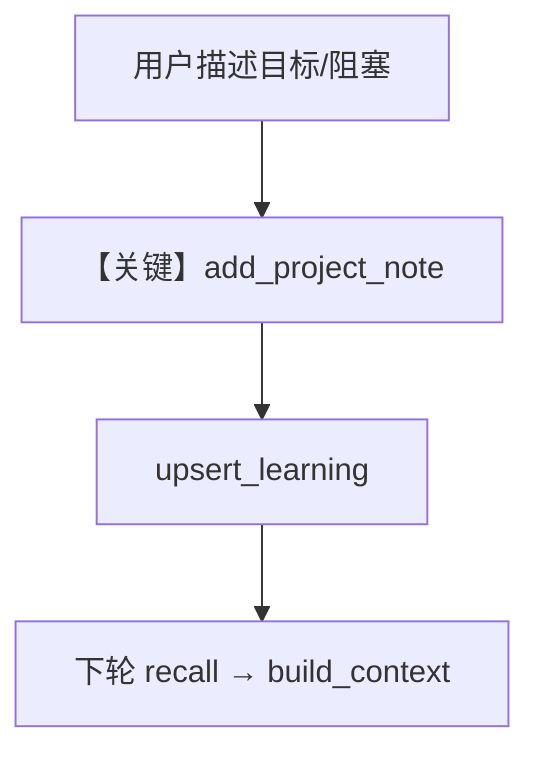

# 02_custom_store_with_db.py — 实现原理分析

> 源文件：`cookbook/08_learning/08_custom_stores/02_custom_store_with_db.py`

## 概述

本示例在自定义 store 中使用 **`db.get_learning` / `db.upsert_learning`** 持久化 `ProjectNotes`，并暴露 **`add_project_note` / `update_project_summary`** 工具；`process` 为空，依赖 AGENTIC 工具写入。

**核心配置一览：**

| 配置项 | 值 | 说明 |
|--------|------|------|
| `db` | `PostgresDb` | Agent 与 store 共享 |
| `learning` | `custom_stores={"project_notes": project_notes_store}` | — |

## 核心组件解析

`build_context` 在无数据时返回含「Use the add_project_note tool...」的提示（`enable_tools=True`），数据存在时追加 `<note_tools>`。

## System Prompt 组装

无 Agent 级 `instructions`；自定义 `build_context` 提供项目注释块与工具提示。

## 完整 API 请求

```python
client.responses.create(model="gpt-5.2", input=[...], tools=[...])
```

## Mermaid 流程图



## 关键源码文件索引

| 文件 | 作用 |
|------|------|
| `agno/db/base` | `get_learning` / `upsert_learning` |
