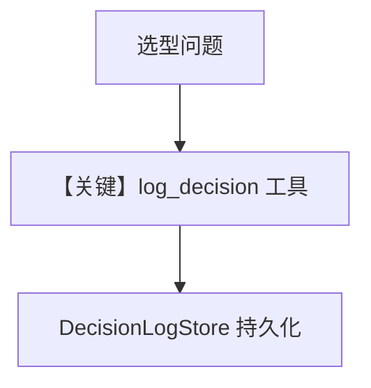

# 01_basic_decision_log.py — 实现原理分析

> 源文件：`cookbook/08_learning/09_decision_logs/01_basic_decision_log.py`

## 概述

本示例展示 **`DecisionLogConfig(mode=AGENTIC)`** 与 **`OpenAIChat(id="gpt-4o")`**：代理通过 **`log_decision`** 工具显式记录决策与理由，用于审计与调试。

**核心配置一览：**

| 配置项 | 值 | 说明 |
|--------|------|------|
| `model` | `OpenAIChat(id="gpt-4o")` | Chat Completions API（非 Responses） |
| `id` / `name` | `decision-logger` / `Decision Logger` | Agent 标识 |
| `learning` | `DecisionLogConfig(AGENTIC, enable_agent_tools=True, agent_can_save=True, agent_can_search=True)` | 决策日志 |
| `instructions` | 列表：助手 + 何时 `log_decision` + 推理与备选 | 多段指令 |

### 还原后的 instructions（合并为三行列表项）

```text
You are a helpful assistant that logs important decisions.
When you make a significant choice (like selecting a tool, choosing a response style, or deciding to ask for clarification), use the log_decision tool to record it.
Include your reasoning and any alternatives you considered.
```

## 核心组件解析

`decision_log_store.print(agent_id="decision-logger", ...)` 与 Agent `id` 对齐。

## 完整 API 请求

```python
# OpenAI Chat Completions
client.chat.completions.create(
    model="gpt-4o",
    messages=[...],
    tools=[...],
)
```

（具体以 `OpenAIChat.invoke` 为准。）

## Mermaid 流程图



## 关键源码文件索引

| 文件 | 作用 |
|------|------|
| `agno/learn/` decision log store | AGENTIC 工具 |
