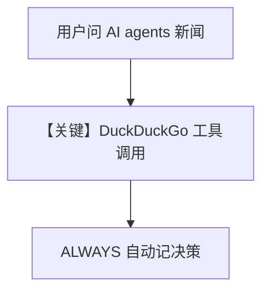

# 02_decision_log_always.py — 实现原理分析

<!-- cookbook-py-source:start -->
## 完整源码

```python
"""
Decision Logs: ALWAYS Mode (Automatic Logging)
===============================================

This example demonstrates automatic decision logging where
tool calls are automatically recorded as decisions.

In ALWAYS mode, DecisionLogStore extracts decisions from:
- Tool calls (which tool was used)
- Other significant choices the agent makes

Run:
    .venvs/demo/bin/python cookbook/08_learning/09_decision_logs/02_decision_log_always.py
"""

from agno.agent import Agent
from agno.db.postgres import PostgresDb
from agno.learn import DecisionLogConfig, LearningMachine, LearningMode
from agno.models.openai import OpenAIChat
from agno.tools.duckduckgo import DuckDuckGoTools

# ---------------------------------------------------------------------------
# Setup
# ---------------------------------------------------------------------------
# Database connection
db = PostgresDb(db_url="postgresql+psycopg://ai:ai@localhost:5532/ai")

# ---------------------------------------------------------------------------
# Create Agent
# ---------------------------------------------------------------------------
# Create an agent with automatic decision logging
# ALWAYS mode: Tool calls are automatically logged as decisions
agent = Agent(
    id="auto-decision-logger",
    name="Auto Decision Logger",
    model=OpenAIChat(id="gpt-4o"),
    db=db,
    learning=LearningMachine(
        decision_log=DecisionLogConfig(
            mode=LearningMode.ALWAYS,
        ),
    ),
    tools=[DuckDuckGoTools()],
    instructions=[
        "You are a helpful research assistant.",
        "Use web search to find current information when needed.",
    ],
    markdown=True,
)

# ---------------------------------------------------------------------------
# Run Agent
# ---------------------------------------------------------------------------
if __name__ == "__main__":
    # Test: Agent uses a tool (will be logged automatically)
    print("=== Test: Agent uses web search ===\n")
    agent.print_response(
        "What are the latest developments in AI agents?",
        session_id="session-002",
    )

    # View auto-logged decisions
    print("\n=== Auto-Logged Decisions ===\n")
    decision_store = agent.learning_machine.decision_log_store
    if decision_store:
        decision_store.print(agent_id="auto-decision-logger", limit=10)
```

<!-- cookbook-py-source:end -->

> 源文件：`cookbook/08_learning/09_decision_logs/02_decision_log_always.py`

## 概述

本示例展示 **`DecisionLogConfig(mode=ALWAYS)`** 与 **`DuckDuckGoTools`**：工具调用被**自动**记为决策，无需模型显式 `log_decision`。

**核心配置一览：**

| 配置项 | 值 | 说明 |
|--------|------|------|
| `model` | `OpenAIChat(id="gpt-4o")` | Chat Completions |
| `tools` | `[DuckDuckGoTools()]` | 可观测工具调用 |
| `learning` | `DecisionLogConfig(mode=ALWAYS)` | 自动从工具调用等抽取决策 |
| `instructions` | 研究助手 + 需要时用网络搜索 | 列表 |

### 还原后的 instructions

```text
You are a helpful research assistant.
Use web search to find current information when needed.
```

## 核心组件解析

与 `01_basic_decision_log` 对照：AGENTIC 显式记录 vs ALWAYS 从行为推断。

## 完整 API 请求

```python
client.chat.completions.create(model="gpt-4o", messages=[...], tools=[...])
```

## Mermaid 流程图



## 关键源码文件索引

| 文件 | 作用 |
|------|------|
| decision log store | ALWAYS 抽取逻辑 |
