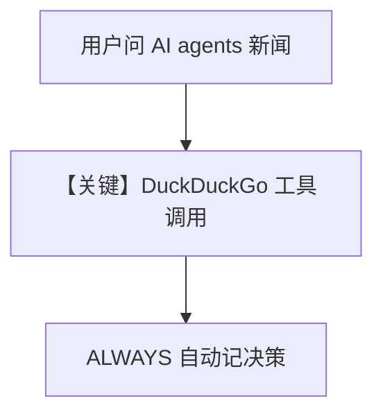

# 02_decision_log_always.py — 实现原理分析

> 源文件：`cookbook/08_learning/09_decision_logs/02_decision_log_always.py`

## 概述

本示例展示 **`DecisionLogConfig(mode=ALWAYS)`** 与 **`DuckDuckGoTools`**：工具调用被**自动**记为决策，无需模型显式 `log_decision`。

**核心配置一览：**

| 配置项 | 值 | 说明 |
|--------|------|------|
| `model` | `OpenAIChat(id="gpt-4o")` | Chat Completions |
| `tools` | `[DuckDuckGoTools()]` | 可观测工具调用 |
| `learning` | `DecisionLogConfig(mode=ALWAYS)` | 自动从工具调用等抽取决策 |
| `instructions` | 研究助手 + 需要时用网络搜索 | 列表 |

### 还原后的 instructions

```text
You are a helpful research assistant.
Use web search to find current information when needed.
```

## 核心组件解析

与 `01_basic_decision_log` 对照：AGENTIC 显式记录 vs ALWAYS 从行为推断。

## 完整 API 请求

```python
client.chat.completions.create(model="gpt-4o", messages=[...], tools=[...])
```

## Mermaid 流程图



## 关键源码文件索引

| 文件 | 作用 |
|------|------|
| decision log store | ALWAYS 抽取逻辑 |
