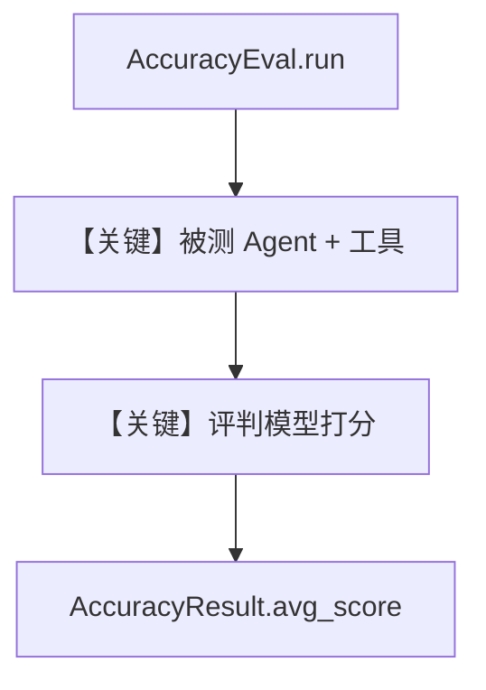

# accuracy_9_11_bigger_or_9_99.py — 实现原理分析

<!-- cookbook-py-source:start -->
## 完整源码

```python
"""
Comparison Accuracy Evaluation
==============================

Demonstrates accuracy evaluation for numeric comparison tasks.
"""

from typing import Optional

from agno.agent import Agent
from agno.eval.accuracy import AccuracyEval, AccuracyResult
from agno.models.openai import OpenAIChat
from agno.tools.calculator import CalculatorTools

# ---------------------------------------------------------------------------
# Create Evaluation
# ---------------------------------------------------------------------------
evaluation = AccuracyEval(
    name="Comparison Evaluation",
    model=OpenAIChat(id="o4-mini"),
    agent=Agent(
        model=OpenAIChat(id="gpt-4o"),
        tools=[CalculatorTools()],
        instructions="You must use the calculator tools for comparisons.",
    ),
    input="9.11 and 9.9 -- which is bigger?",
    expected_output="9.9",
    additional_guidelines="Its ok for the output to include additional text or information relevant to the comparison.",
)

# ---------------------------------------------------------------------------
# Run Evaluation
# ---------------------------------------------------------------------------
if __name__ == "__main__":
    result: Optional[AccuracyResult] = evaluation.run(print_results=True)
    assert result is not None and result.avg_score >= 8
```

<!-- cookbook-py-source:end -->

> 源文件：`cookbook/09_evals/accuracy/accuracy_9_11_bigger_or_9_99.py`

## 概述

本示例用 **`AccuracyEval`** 评测 **数值比较类任务**（经典 9.11 vs 9.9）：被测 Agent 带计算器工具，评判模型 `o4-mini` 按期望输出与指南打分。

**核心配置一览：**

| 配置项 | 值 | 说明 |
|--------|------|------|
| `AccuracyEval.model` | `OpenAIChat(id="o4-mini")` | 评分用评判模型（Chat Completions） |
| `agent` | `gpt-4o` + `CalculatorTools` | 被测 Agent |
| `agent.instructions` | `"You must use the calculator tools for comparisons."` | 强制用工具 |
| `input` / `expected_output` | `9.11 and 9.9...` / `9.9` | 用例与标准答案 |
| `additional_guidelines` | 允许附加解释性文字 | 放宽严格字符串匹配 |

## 架构分层

```
AccuracyEval.run()
  → 被测 Agent.run(input) → 得到输出
  → 评判模型按 expected_output + guidelines 打分（默认 evaluator 逻辑见 agno/eval/accuracy.py）
```

## 核心组件解析

### 运行机制与因果链

1. **数据进/出**：用户脚本提供 `input`；`evaluation.run()` 内部驱动 agent 生成答案，再交给 evaluator 产出 `AccuracyResult`（含 `avg_score`）。
2. **副作用**：默认不写库；对比 `db_logging.py`。
3. **分支**：可换 `num_iterations`、异步 `arun`（见 `accuracy_basic.py`）。

## System Prompt 组装

存在**两套**提示词：**被测 Agent** 走 `get_system_message()`（本例含 `instructions` 与 markdown 附加）；**评判 Agent** 由 `AccuracyEval.get_evaluator_agent()` 构建，默认指令在 `agno/eval/accuracy.py` 内定义，完整文本请以源码为准或在运行时打印 evaluator 的 system message。

### 被测 Agent 可静态还原的 instructions

```text
You must use the calculator tools for comparisons.
```

## 完整 API 请求

- 被测：`OpenAIChat` → `chat.completions.create`。
- 评判：同系 API，由 `AccuracyEval` 内部调用。

## Mermaid 流程图



## 关键源码文件索引

| 文件 | 作用 |
|------|------|
| `agno/eval/accuracy.py` | `AccuracyEval`、`run` |
| `agno/agent/_messages.py` | 被测 Agent system |
