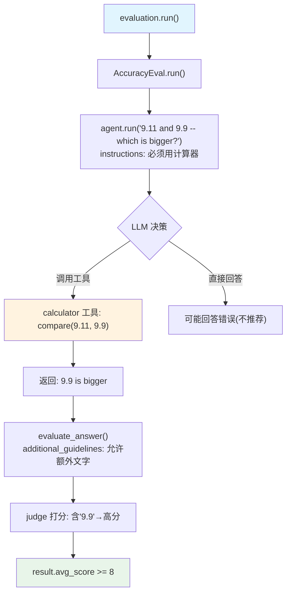

# accuracy_9_11_bigger_or_9_99.py — 实现原理分析

> 源文件：`cookbook/09_evals/accuracy/accuracy_9_11_bigger_or_9_99.py`

## 概述

本示例展示 **`AccuracyEval`** 用于数值比较边界场景的验证：9.11 与 9.9 的大小比较（LLM 易混淆的经典陷阱题），通过 `instructions` 强制 Agent 使用计算器工具，并通过 `additional_guidelines` 允许输出包含额外文字说明。

**核心配置一览：**

| 配置项 | 值 | 说明 |
|--------|------|------|
| `name` | `"Comparison Evaluation"` | 评估名称 |
| `model` | `OpenAIChat(id="o4-mini")` | 评判模型 |
| `agent` | `Agent(OpenAIChat("gpt-4o"), tools=[CalculatorTools()], instructions="You must use the calculator tools for comparisons.")` | 被评估 Agent |
| `input` | `"9.11 and 9.9 -- which is bigger?"` | 数值比较问题 |
| `expected_output` | `"9.9"` | 期望答案 |
| `additional_guidelines` | `"Its ok for the output to include additional text or information relevant to the comparison."` | 宽松评判标准 |
| `num_iterations` | `1`（默认） | 迭代次数 |

## 架构分层

```
用户代码层                      agno.eval 层
┌──────────────────────┐    ┌────────────────────────────────────────┐
│ accuracy_9_11_       │    │ AccuracyEval.run()                     │
│ bigger_or_9_99.py    │    │  ├─ agent.run("9.11 and 9.9 which...")│
│                      │───>│  │    instructions: 必须用计算器工具   │
│ evaluation.run()     │    │  ├─ evaluate_answer()                  │
│                      │    │  │    additional_guidelines: 允许      │
│                      │    │  │    包含额外文字说明                 │
└──────────────────────┘    └────────────────────────────────────────┘
```

## 核心组件解析

### additional_guidelines 的作用

`additional_guidelines` 追加到评判 Agent 的 system prompt（`accuracy.py:205-211`）：

```python
# 追加到评判 prompt
additional_guidelines = "\n## Additional Guidelines\n"
additional_guidelines += self.additional_guidelines
# → "Its ok for the output to include additional text..."
```

这使评判模型在计算答案正确（含 9.9）的前提下，不扣分于额外文字说明。

### instructions 影响 Agent 行为

```python
Agent(
    instructions="You must use the calculator tools for comparisons.",
    # → 强制 Agent 调用 CalculatorTools 比较 9.11 vs 9.9
    # → 避免 LLM 误将 9.11 判断为大于 9.9（位数陷阱）
)
```

## System Prompt 组装（评判 Agent）

| 组成部分 | 内容 |
|---------|------|
| `description` | "You are an expert judge..." |
| 评估标准 | Accuracy + Completeness |
| 评分规则 | 1-10 分 |
| `additional_guidelines` | "Its ok for the output to include additional text or information relevant to the comparison." |

## Mermaid 流程图



## 关键源码文件索引

| 文件 | 关键函数/类 | 作用 |
|------|------------|------|
| `agno/eval/accuracy.py` | `get_evaluator_agent()` L188-L254 | additional_guidelines 注入逻辑 |
| `agno/eval/accuracy.py` | `run()` L343 | 主流程 |
| `agno/agent/agent.py` | `instructions` L229 | 指令注入被评估 Agent |
