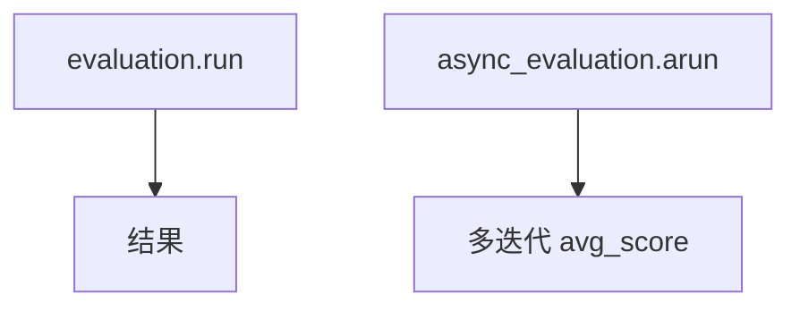

# accuracy_basic.py — 实现原理分析

> 源文件：`cookbook/09_evals/accuracy/accuracy_basic.py`

## 概述

本示例演示 **`AccuracyEval.run`（同步）与 `arun`（异步）**：计算器 Agent、`o4-mini` 评判、`num_iterations` 在异步版本为 3。

**核心配置一览：**

| 配置项 | 值 | 说明 |
|--------|------|------|
| `evaluation` | `num_iterations=1` | 同步单次 |
| `async_evaluation` | `num_iterations=3` | 异步多次迭代 |
| `expected_output` | `2500` | 期望最终数值 |

## 核心组件解析

`asyncio.run(async_evaluation.arun(...))` 验证异步评测路径与指标聚合。

## System Prompt 组装

被测 Agent 未设 `instructions`，仅有默认 markdown 等；评判端见 `accuracy.py`。

## 完整 API 请求

同步与异步两套 `chat.completions` / `achat` 路径（以各 `OpenAIChat` 方法为准）。

## Mermaid 流程图

## 关键源码文件索引

| 文件 | 作用 |
|------|------|
| `agno/eval/accuracy.py` | `run` / `arun` |
