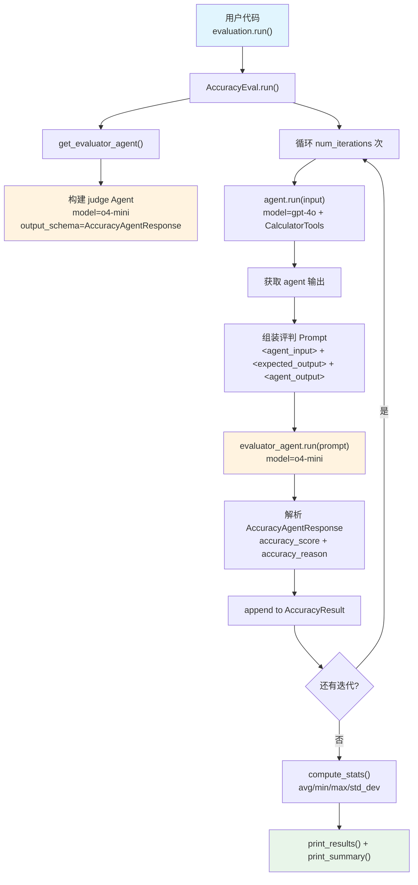

# accuracy_basic.py — 实现原理分析

> 源文件：`cookbook/09_evals/accuracy/accuracy_basic.py`

## 概述

本示例展示 Agno 的 **`AccuracyEval`** 机制：用一个评判模型（judge）对 Agent 的输出与期望输出进行打分（1-10分），支持同步和异步两种运行模式，以及多次迭代统计。

**核心配置一览：**

| 配置项 | 值 | 说明 |
|--------|------|------|
| `name` | `"Calculator Evaluation"` | 评估名称 |
| `model` | `OpenAIChat(id="o4-mini")` | 评判模型（judge） |
| `agent` | `Agent(OpenAIChat("gpt-4o"), tools=[CalculatorTools()])` | 被评估 Agent |
| `input` | `"What is 10*5 then to the power of 2? do it step by step"` | 评估输入 |
| `expected_output` | `"2500"` | 期望输出 |
| `additional_guidelines` | `"Agent output should include the steps..."` | 评判额外指引 |
| `num_iterations` | `1` / `3` | 迭代次数 |
| `db` | `None` | 未设置，不持久化 |

## 架构分层

```
用户代码层                      agno.eval 层
┌──────────────────────┐    ┌────────────────────────────────────────┐
│ accuracy_basic.py    │    │ AccuracyEval.run()                     │
│                      │    │  ├─ 1. get_evaluator_agent()           │
│ evaluation.run()     │───>│  │    → 构建 judge Agent               │
│   num_iterations=1   │    │  ├─ 2. agent.run(input)               │
│                      │    │  │    → 被评估 Agent 执行              │
│ async_evaluation     │    │  ├─ 3. evaluate_answer()               │
│   .arun()            │    │  │    → evaluator_agent.run(prompt)    │
│   num_iterations=3   │    │  └─ 4. AccuracyResult 统计             │
└──────────────────────┘    └────────────────────────────────────────┘
                                        │
                        ┌───────────────┴────────────────┐
                        ▼                                ▼
                ┌──────────────┐              ┌──────────────────┐
                │ OpenAIChat   │              │ OpenAIChat       │
                │ gpt-4o       │              │ o4-mini          │
                │ (被评估)     │              │ (judge 评判)     │
                └──────────────┘              └──────────────────┘
```

## 核心组件解析

### AccuracyEval

`AccuracyEval` 是精度评估的核心 dataclass（`agno/eval/accuracy.py:142`）。关键流程：

```python
# accuracy.py:343 run() 方法核心流程
for i in range(self.num_iterations):
    # 1. 运行被评估 Agent
    run_response = self.agent.run(input=eval_input, session_id=agent_session_id, stream=False)
    output = run_response.content

    # 2. 组装评判输入（XML 格式）
    evaluation_input = f"""
    <agent_input>{eval_input}</agent_input>
    <expected_output>{eval_expected_output}</expected_output>
    <agent_output>{output}</agent_output>
    """

    # 3. 评判 Agent 打分
    result = self.evaluate_answer(...)
    self.result.results.append(result)
```

### evaluator_agent（评判 Agent）

由 `get_evaluator_agent()`（`accuracy.py:188`）动态构建：

```python
# 评判 Agent 使用结构化输出
Agent(
    model=OpenAIChat(id="o4-mini"),
    description="You are an expert judge...",
    output_schema=AccuracyAgentResponse,  # 强制输出 JSON
    structured_outputs=True,
)
```

### AccuracyAgentResponse 结构化输出

```python
class AccuracyAgentResponse(BaseModel):
    accuracy_score: int  # 1-10 分
    accuracy_reason: str  # 评判理由
```

### AccuracyResult 统计

```python
# accuracy.py:63 自动计算统计量
AccuracyResult:
    avg_score / mean_score / min_score / max_score / std_dev_score
```

### 指标回传（metrics 累积）

`evaluate_answer()`（`accuracy.py:277`）支持将评判模型的 token 使用量累积到被评估 Agent 的 `run_output.metrics` 中：

```python
if run_metrics is not None and response.metrics is not None:
    from agno.metrics import accumulate_eval_metrics
    accumulate_eval_metrics(response.metrics, run_metrics)  # 合并到父 metrics
```

## System Prompt 组装（评判 Agent）

评判 Agent 的 system prompt 由 `get_evaluator_agent()` 硬编码构建，不走标准 `get_system_message()` 流程：

| 组成部分 | 内容 |
|---------|------|
| `description` | "You are an expert judge tasked with comparing..." |
| 评估标准 | Accuracy + Completeness（与 expected_output 对比） |
| 评分规则 | 1-2 完全错误 / 5-6 部分正确 / 9-10 高度准确 |
| `additional_guidelines` | "Agent output should include the steps and the final answer." |
| `output_schema` | `AccuracyAgentResponse`（强制 structured output） |

### 最终评判输入 Prompt

```text
<agent_input>
What is 10*5 then to the power of 2? do it step by step
</agent_input>

<expected_output>
2500
</expected_output>

<agent_output>
[gpt-4o 的实际输出]
</agent_output>
```

## 完整 API 请求

**第 1 步：被评估 Agent 调用**

```python
client.chat.completions.create(
    model="gpt-4o",
    messages=[
        {"role": "system", "content": ""},  # 无 system_message
        {"role": "user", "content": "What is 10*5 then to the power of 2? do it step by step"}
    ],
    tools=[{
        "type": "function",
        "function": {
            "name": "multiply",
            "description": "Multiply two numbers together.",
            "parameters": {"type": "object", "properties": {"a": {"type": "number"}, "b": {"type": "number"}}, "required": ["a", "b"]}
        }
    }, ...],  # CalculatorTools 的所有工具
    stream=False
)
```

**第 2 步：评判 Agent 调用**

```python
client.chat.completions.create(
    model="o4-mini",
    messages=[
        {"role": "system", "content": "You are an expert judge tasked with comparing..."},
        {"role": "user", "content": "<agent_input>...<expected_output>...<agent_output>..."}
    ],
    response_format={"type": "json_schema", "json_schema": {"name": "AccuracyAgentResponse", ...}},
    stream=False
)
```

## Mermaid 流程图



## 关键源码文件索引

| 文件 | 关键函数/类 | 作用 |
|------|------------|------|
| `agno/eval/accuracy.py` | `AccuracyEval` L142 | 精度评估 dataclass |
| `agno/eval/accuracy.py` | `get_evaluator_agent()` L188 | 动态构建 judge Agent |
| `agno/eval/accuracy.py` | `evaluate_answer()` L277 | 单次评判流程 |
| `agno/eval/accuracy.py` | `run()` L343 | 同步运行入口 |
| `agno/eval/accuracy.py` | `arun()` L493 | 异步运行入口 |
| `agno/eval/accuracy.py` | `AccuracyAgentResponse` L24 | 评判输出 Pydantic 模型 |
| `agno/eval/accuracy.py` | `AccuracyResult` L63 | 统计结果容器 |
