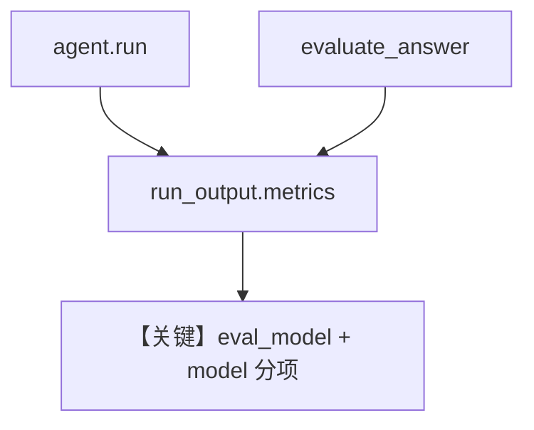

# accuracy_eval_metrics.py — 实现原理分析

> 源文件：`cookbook/09_evals/accuracy/accuracy_eval_metrics.py`

## 概述

本示例演示 **`evaluate_answer(..., run_response=run_output)`**：把评判模型的 token 指标合并进**原 Agent 的 `run_output.metrics.details["eval_model"]`**，与 `["model"]` 并列，便于单次 run 总览。

**核心配置一览：**

| 配置项 | 值 | 说明 |
|--------|------|------|
| `agent.instructions` | `"Answer factual questions concisely."` | 被测 |
| 流程 | 先 `agent.run`，再手动拼 `evaluation_input`，调用 `evaluate_answer` | 细粒度控制 |

### 还原 instructions

```text
Answer factual questions concisely.
```

## 核心组件解析

`evaluation_input` 将 `<agent_input>`、`<expected_output>`、`<agent_output>` 三段 XML 风格拼给评判器。

## System Prompt 组装

被测 Agent：含上述 instructions；评判 Agent：默认 evaluator 模板（见 `agno/eval/accuracy.py`）。

## 完整 API 请求

两次模型调用：一次 agent，一次 evaluator（经 `evaluate_answer`）。

## Mermaid 流程图



## 关键源码文件索引

| 文件 | 作用 |
|------|------|
| `agno/eval/accuracy.py` | `evaluate_answer` |
