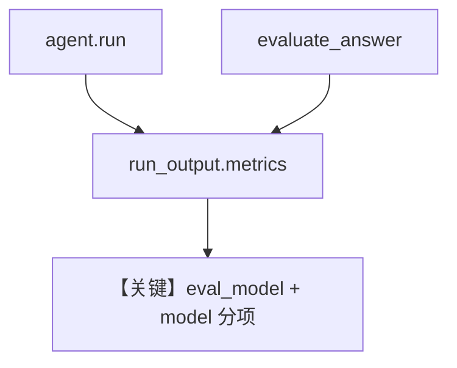

# accuracy_eval_metrics.py — 实现原理分析

<!-- cookbook-py-source:start -->
## 完整源码

```python
"""
Accuracy Eval Metrics
=====================

Demonstrates that eval model metrics can be accumulated into the original
agent's run_output using the run_response parameter on evaluate_answer.

The evaluator agent's token usage appears under "eval_model" in
run_output.metrics.details alongside the agent's own "model" entries.
"""

from agno.agent import Agent
from agno.eval.accuracy import AccuracyEval
from agno.models.openai import OpenAIChat
from rich.pretty import pprint

# ---------------------------------------------------------------------------
# Setup
# ---------------------------------------------------------------------------
agent = Agent(
    model=OpenAIChat(id="gpt-4o-mini"),
    instructions="Answer factual questions concisely.",
)

evaluation = AccuracyEval(
    name="Capital Cities",
    model=OpenAIChat(id="gpt-4o-mini"),
    agent=agent,
    input="What is the capital of Japan?",
    expected_output="Tokyo",
    num_iterations=1,
)

# ---------------------------------------------------------------------------
# Run
# ---------------------------------------------------------------------------
if __name__ == "__main__":
    # First, run the agent to get a response
    run_output = agent.run("What is the capital of Japan?")
    agent_output = str(run_output.content)

    # Run the evaluator, passing run_output so eval metrics accumulate into it
    evaluator_agent = evaluation.get_evaluator_agent()
    eval_input = evaluation.get_eval_input()
    eval_expected = evaluation.get_eval_expected_output()

    evaluation_input = (
        f"<agent_input>\n{eval_input}\n</agent_input>\n\n"
        f"<expected_output>\n{eval_expected}\n</expected_output>\n\n"
        f"<agent_output>\n{agent_output}\n</agent_output>"
    )

    result = evaluation.evaluate_answer(
        input=eval_input,
        evaluator_agent=evaluator_agent,
        evaluation_input=evaluation_input,
        evaluator_expected_output=eval_expected,
        agent_output=agent_output,
        run_response=run_output,
    )

    if result:
        print(f"Score: {result.score}/10")
        print(f"Reason: {result.reason[:200]}")

    # The run_output now has both agent + eval metrics
    if run_output.metrics:
        print("\nTotal tokens (agent + eval):", run_output.metrics.total_tokens)

        if run_output.metrics.details:
            if "model" in run_output.metrics.details:
                agent_tokens = sum(
                    metric.total_tokens
                    for metric in run_output.metrics.details["model"]
                )
                print("Agent model tokens:", agent_tokens)

            if "eval_model" in run_output.metrics.details:
                eval_tokens = sum(
                    metric.total_tokens
                    for metric in run_output.metrics.details["eval_model"]
                )
                print("Eval model tokens:", eval_tokens)

            print("\nFull metrics breakdown:")
            pprint(run_output.metrics.to_dict())
```

<!-- cookbook-py-source:end -->

> 源文件：`cookbook/09_evals/accuracy/accuracy_eval_metrics.py`

## 概述

本示例演示 **`evaluate_answer(..., run_response=run_output)`**：把评判模型的 token 指标合并进**原 Agent 的 `run_output.metrics.details["eval_model"]`**，与 `["model"]` 并列，便于单次 run 总览。

**核心配置一览：**

| 配置项 | 值 | 说明 |
|--------|------|------|
| `agent.instructions` | `"Answer factual questions concisely."` | 被测 |
| 流程 | 先 `agent.run`，再手动拼 `evaluation_input`，调用 `evaluate_answer` | 细粒度控制 |

### 还原 instructions

```text
Answer factual questions concisely.
```

## 核心组件解析

`evaluation_input` 将 `<agent_input>`、`<expected_output>`、`<agent_output>` 三段 XML 风格拼给评判器。

## System Prompt 组装

被测 Agent：含上述 instructions；评判 Agent：默认 evaluator 模板（见 `agno/eval/accuracy.py`）。

## 完整 API 请求

两次模型调用：一次 agent，一次 evaluator（经 `evaluate_answer`）。

## Mermaid 流程图



## 关键源码文件索引

| 文件 | 作用 |
|------|------|
| `agno/eval/accuracy.py` | `evaluate_answer` |
