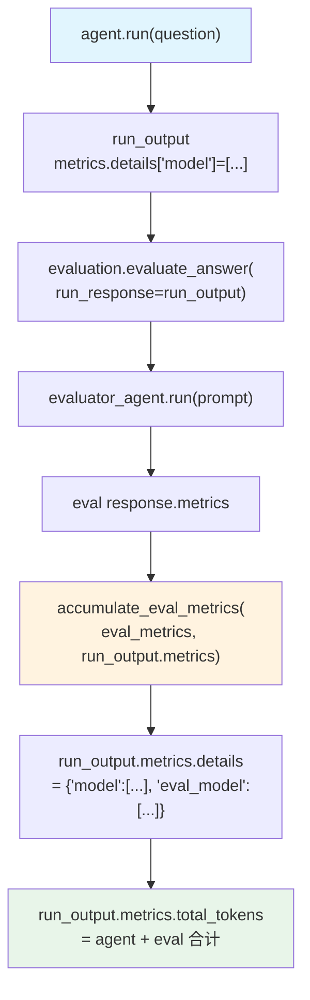

# accuracy_eval_metrics.py — 实现原理分析

> 源文件：`cookbook/09_evals/accuracy/accuracy_eval_metrics.py`

## 概述

本示例展示 **`AccuracyEval.evaluate_answer()`** 的 `run_response` 参数机制：将评判模型（eval model）的 token 使用量**回传累积**到被评估 Agent 的 `run_output.metrics` 中，使两者的 token 消耗可以统一追踪，并在 `metrics.details` 下分类显示（`"model"` 键 vs `"eval_model"` 键）。

**核心配置一览：**

| 配置项 | 值 | 说明 |
|--------|------|------|
| `name` | `"Capital Cities"` | 评估名称 |
| `model` | `OpenAIChat(id="gpt-4o-mini")` | 评判模型 |
| `agent` | `Agent(OpenAIChat("gpt-4o-mini"), instructions="Answer factual questions concisely.")` | 被评估 Agent |
| `input` | `"What is the capital of Japan?"` | 评估输入 |
| `expected_output` | `"Tokyo"` | 期望输出 |
| `num_iterations` | `1` | 迭代次数 |

## 架构分层

```
用户代码层                      agno.eval 层
┌──────────────────────┐    ┌────────────────────────────────────────────┐
│ accuracy_eval_       │    │ 手动流程（不用 eval.run()）                  │
│ metrics.py           │    │                                             │
│                      │    │  1. agent.run("What is the capital...")     │
│ run_output =         │───>│     → run_output.metrics 有 agent tokens    │
│   agent.run(...)     │    │                                             │
│                      │    │  2. evaluation.evaluate_answer(             │
│ evaluation           │    │       run_response=run_output  ← 关键参数  │
│  .evaluate_answer(   │    │     )                                      │
│    run_response=     │    │     → evaluator_agent.run(prompt)           │
│    run_output        │    │     → accumulate_eval_metrics(              │
│  )                   │    │         eval_metrics → run_output.metrics)  │
└──────────────────────┘    └────────────────────────────────────────────┘
```

## 核心组件解析

### evaluate_answer() 的 run_response 参数

`evaluate_answer()`（`accuracy.py:277`）接收 `run_metrics` 参数，用于将评判 token 累积到父 metrics：

```python
def evaluate_answer(
    self,
    input: str,
    evaluator_agent: Agent,
    evaluation_input: str,
    evaluator_expected_output: str,
    agent_output: str,
    run_metrics: Optional["RunMetrics"] = None,  # ← 注意：参数名实为 run_metrics
) -> Optional[AccuracyEvaluation]:
    response = evaluator_agent.run(evaluation_input, stream=False)

    # 关键：将 eval model 的 metrics 累积到 agent 的 run_metrics
    if run_metrics is not None and response.metrics is not None:
        from agno.metrics import accumulate_eval_metrics
        accumulate_eval_metrics(response.metrics, run_metrics)
```

### metrics.details 分类结构

累积后，`run_output.metrics.details` 中会有两个键：

```python
{
    "model": [ModelMetrics(...)],       # Agent 自身的 token 使用
    "eval_model": [ModelMetrics(...)],  # 评判模型的 token 使用（累积进来）
}
```

### 手动调用流程（本文件展示的方式）

```python
# 1. 运行 Agent
run_output = agent.run("What is the capital of Japan?")

# 2. 手动准备评判输入
evaluator_agent = evaluation.get_evaluator_agent()
eval_input = evaluation.get_eval_input()
eval_expected = evaluation.get_eval_expected_output()
evaluation_input = f"<agent_input>{eval_input}</agent_input>..."

# 3. 传入 run_output（实际传的是 run_output 本身，函数内取其 metrics）
result = evaluation.evaluate_answer(
    input=eval_input,
    evaluator_agent=evaluator_agent,
    evaluation_input=evaluation_input,
    evaluator_expected_output=eval_expected,
    agent_output=str(run_output.content),
    run_response=run_output,  # ← run_output 作为 run_response（函数内访问 .metrics）
)

# 4. run_output.metrics 现在包含 agent + eval 两者的 token
print(run_output.metrics.total_tokens)  # 合计
```

## System Prompt 组装（评判 Agent）

与 `accuracy_basic.py` 相同，无额外 guidelines。

## 完整 API 请求

**第 1 步：Agent 调用**

```python
client.chat.completions.create(
    model="gpt-4o-mini",
    messages=[
        {"role": "system", "content": "Answer factual questions concisely."},
        {"role": "user", "content": "What is the capital of Japan?"}
    ],
    stream=False
)
# → run_output.metrics.details["model"] = [ModelMetrics(total_tokens=...)]
```

**第 2 步：评判 Agent 调用（token 累积到 run_output.metrics）**

```python
client.chat.completions.create(
    model="gpt-4o-mini",
    messages=[
        {"role": "system", "content": "You are an expert judge..."},
        {"role": "user", "content": "<agent_input>...<expected_output>Tokyo</expected_output>..."}
    ],
    response_format={"type": "json_schema", ...},
    stream=False
)
# → evaluator metrics → accumulate_eval_metrics → run_output.metrics.details["eval_model"]
```

## Mermaid 流程图



## 关键源码文件索引

| 文件 | 关键函数/类 | 作用 |
|------|------------|------|
| `agno/eval/accuracy.py` | `evaluate_answer()` L277 | 含 run_metrics 累积逻辑 |
| `agno/eval/accuracy.py` | `get_evaluator_agent()` L188 | 构建评判 Agent |
| `agno/metrics/__init__.py` | `accumulate_eval_metrics()` | 将 eval metrics 合并到父 metrics |
