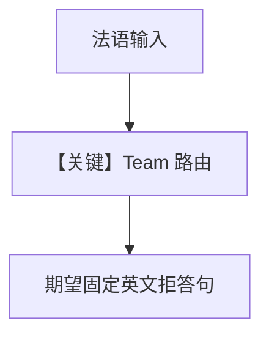

# accuracy_team.py — 实现原理分析

> 源文件：`cookbook/09_evals/accuracy/accuracy_team.py`

## 概述

本示例用 **`AccuracyEval` 的 `team=`** 评测 **Team 路由**：用户问法语，期望 Team 用英文回复固定句式说明仅支持英/西。

**核心配置一览：**

| 配置项 | 值 | 说明 |
|--------|------|------|
| `Team` | `english_agent` + `spanish_agent`，`respond_directly=True` | 多成员 |
| `Team.instructions` | 路由规则 + 不支持语言时的英文模板 | 列表 |
| `AccuracyEval` | `team=multi_language_team`，`input="Comment allez-vous?"` | 评 Team 输出 |

## 核心组件解析

评测对象从单 Agent 换为 `Team.run`，评判模型仍比对 `expected_output` 字符串。

## System Prompt 组装

- 各成员 Agent：`role` 进入 system（`get_system_message` 中 `# 3.3.2`）。
- Team 层另有 coordinator 指令（见 `agno/team/`）。

### Team instructions（列表拼接，语义还原）

```text
You are a language router that directs questions to the appropriate language agent.
If the user asks in a language whose agent is not a team member, respond in English with:
'I can only answer in the following languages: English and Spanish.
Always check the language of the user's input before routing to an agent.
```

（原文在 `.py` 中为多元素列表，引号与换行以源文件为准。）

## 完整 API 请求

Team 协调器 + 成员：多次 `chat.completions` 或 Team 封装调用。

## Mermaid 流程图



## 关键源码文件索引

| 文件 | 作用 |
|------|------|
| `agno/team/team.py` | Team 执行 |
| `agno/eval/accuracy.py` | 对 team 输出评分 |
