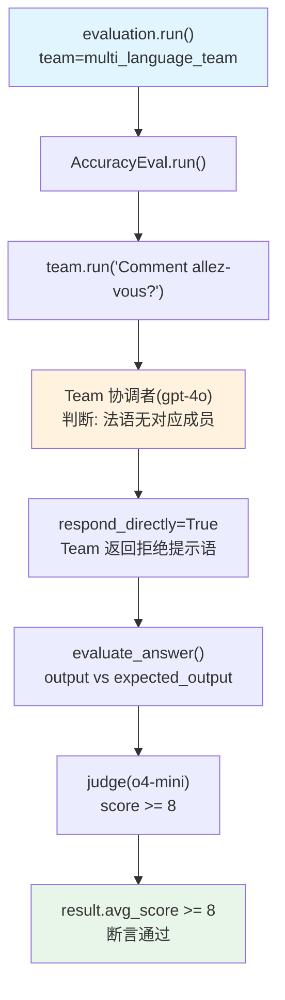

# accuracy_team.py — 实现原理分析

> 源文件：`cookbook/09_evals/accuracy/accuracy_team.py`

## 概述

本示例展示 **`AccuracyEval`** 对 **Team（多成员团队）** 的评估：用多语言路由团队作为被评估对象，验证它能正确拒绝非英语/西班牙语查询并返回提示语。

**核心配置一览：**

| 配置 | 值 | 说明 |
|------|------|------|
| **AccuracyEval** | | |
| `name` | `"Multi Language Team"` | 评估名称 |
| `model` | `OpenAIChat(id="o4-mini")` | 评判模型 |
| `team` | `multi_language_team` | 被评估 Team（非 Agent） |
| `input` | `"Comment allez-vous?"` | 法语输入（期望被拒绝） |
| `expected_output` | `"I can only answer in the following languages: English and Spanish."` | 期望输出 |
| `num_iterations` | `1` | 迭代次数 |
| **Team** | | |
| `name` | `"Multi Language Team"` | Team 名称 |
| `model` | `OpenAIChat("gpt-4o")` | Team 协调模型 |
| `members` | `[english_agent, spanish_agent]` | 英语 + 西班牙语成员 |
| `respond_directly` | `True` | 成员直接响应 |
| `markdown` | `True` | 开启 markdown |

## 架构分层

```
用户代码层                      agno.eval 层
┌──────────────────────┐    ┌────────────────────────────────────────┐
│ accuracy_team.py     │    │ AccuracyEval.run()                     │
│                      │    │  ├─ team.run(input)  ← 注意是 team     │
│ evaluation.run()     │───>│  │    → Team 判断法语无对应成员        │
│   team=...           │    │  │    → 返回拒绝提示语                 │
│                      │    │  ├─ evaluate_answer()                  │
└──────────────────────┘    └────────────────────────────────────────┘
                                        │
                    ┌───────────────────┴──────────────┐
                    ▼                                  ▼
            ┌──────────────┐                ┌──────────────────┐
            │ OpenAIChat   │                │ OpenAIChat       │
            │ gpt-4o       │                │ o4-mini (judge)  │
            │ (Team 协调)  │                └──────────────────┘
            └──────────────┘
```

## 核心组件解析

### Team vs Agent 评估路径

`AccuracyEval.run()` 中根据 `team` 字段分支（`accuracy.py:386-389`）：

```python
if self.agent is not None:
    run_response = self.agent.run(input=eval_input, ...)
    output = run_response.content
elif self.team is not None:
    run_response = self.team.run(input=eval_input, ...)  # ← Team 路径
    output = run_response.content
```

### Team 路由逻辑

```python
Team(
    model=OpenAIChat("gpt-4o"),
    members=[english_agent, spanish_agent],  # 只有英/西语成员
    respond_directly=True,  # 成员直接响应而非汇总
    instructions=[
        "If the user asks in a language whose agent is not a team member, respond in English with: "
        "'I can only answer in the following languages: English and Spanish.",
    ],
)
# 法语输入 → Team 协调者 → 无匹配成员 → 返回固定拒绝语
```

### DB 日志记录（Team 场景）

当 team 评估完成后，DB 日志使用 `team_id` 而非 `agent_id`（`accuracy.py:449-454`）：

```python
team_id = self.team.id
model_id = self.team.model.id  # gpt-4o
evaluated_component_name = self.team.name  # "Multi Language Team"
```

## System Prompt 组装（评判 Agent）

| 组成部分 | 内容 |
|---------|------|
| `description` | "You are an expert judge..." |
| 评估标准 | Accuracy + Completeness |
| 评分规则 | 1-10 分 |
| `additional_guidelines` | 无 |

## Mermaid 流程图



## 关键源码文件索引

| 文件 | 关键函数/类 | 作用 |
|------|------------|------|
| `agno/eval/accuracy.py` | `run()` L386-389 | team 路径分支 |
| `agno/eval/accuracy.py` | `run()` L449-454 | team 的 DB 日志字段 |
| `agno/team/team.py` | `Team.run()` | Team 执行入口 |
