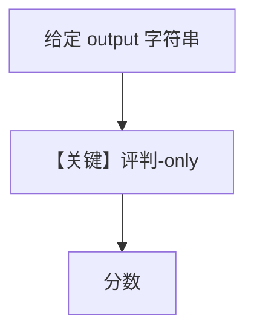

# accuracy_with_given_answer.py — 实现原理分析

> 源文件：`cookbook/09_evals/accuracy/accuracy_with_given_answer.py`

## 概述

本示例演示 **`run_with_output(output="...")`**：不重新跑被测 Agent，直接对**给定字符串**做准确度评判，适合离线已有日志或 A/B 文本。

**核心配置一览：**

| 配置项 | 值 | 说明 |
|--------|------|------|
| `AccuracyEval` | 仅 `model` + `input` + `expected_output`，无 `agent` | 无被测 Agent |
| `run_with_output` | `output="2500"` | 注入假定的 agent 输出 |

## 核心组件解析

数据路径缩短为：固定 output → evaluator → `AccuracyResult`。

## System Prompt 组装

无被测 Agent 的 `get_system_message`；仅评判器侧（默认 `AccuracyEval` 内置 evaluator）。

## 完整 API 请求

仅评判模型一次（或随实现而定）。

## Mermaid 流程图

## 关键源码文件索引

| 文件 | 作用 |
|------|------|
| `agno/eval/accuracy.py` | `run_with_output` |
