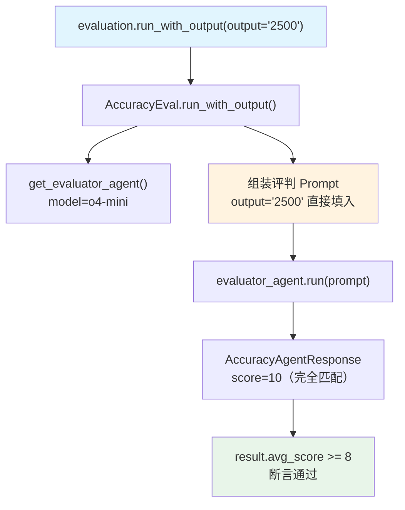

# accuracy_with_given_answer.py — 实现原理分析

> 源文件：`cookbook/09_evals/accuracy/accuracy_with_given_answer.py`

## 概述

本示例展示 Agno **`AccuracyEval.run_with_output()`** 机制：直接提供一个已知答案字符串，跳过 Agent 运行步骤，让评判模型对该答案与期望输出进行打分。适用于离线测试已有答案的精度。

**核心配置一览：**

| 配置项 | 值 | 说明 |
|--------|------|------|
| `name` | `"Given Answer Evaluation"` | 评估名称 |
| `model` | `OpenAIChat(id="o4-mini")` | 评判模型 |
| `agent` | `None` | 未设置，直接传入答案 |
| `team` | `None` | 未设置 |
| `input` | 计算问题字符串 | 评估输入 |
| `expected_output` | `"2500"` | 期望输出 |
| `additional_guidelines` | `None` | 未设置 |

## 架构分层

```
用户代码层                      agno.eval 层
┌──────────────────────┐    ┌────────────────────────────────────────┐
│ accuracy_with_given_ │    │ AccuracyEval.run_with_output()         │
│ answer.py            │    │  ├─ get_evaluator_agent() → judge      │
│                      │    │  ├─ [跳过 agent.run() 步骤]            │
│ evaluation           │───>│  ├─ evaluate_answer(                   │
│  .run_with_output(   │    │  │    input=eval_input,                │
│    output="2500"     │    │  │    output="2500",  ← 直接传入       │
│  )                   │    │  │    ...)                             │
└──────────────────────┘    └────────────────────────────────────────┘
                                        │
                                        ▼
                                ┌──────────────────┐
                                │ OpenAIChat       │
                                │ o4-mini (judge)  │
                                └──────────────────┘
```

## 核心组件解析

### run_with_output()

与 `run()` 的核心区别：跳过 Agent 运行，直接用传入的 `output` 参数进行评判（`accuracy.py:636`）：

```python
def run_with_output(self, *, output: str, ...) -> Optional[AccuracyResult]:
    evaluator_agent = self.get_evaluator_agent()
    eval_input = self.get_eval_input()
    eval_expected_output = self.get_eval_expected_output()

    # 直接组装评判 Prompt，不运行 Agent
    evaluation_input = f"""
    <agent_input>{eval_input}</agent_input>
    <expected_output>{eval_expected_output}</expected_output>
    <agent_output>{output}</agent_output>  ← 外部传入
    """
    result = self.evaluate_answer(...)
```

| 方法 | 是否运行 Agent | 适用场景 |
|------|--------------|---------|
| `run()` | 是 | 在线评估，Agent 实时生成答案 |
| `run_with_output(output=...)` | 否 | 离线评估已有答案 |
| `arun()` | 是（async） | 异步在线评估 |

## System Prompt 组装（评判 Agent）

与 `accuracy_basic.py` 相同，评判 Agent 的 system prompt 由 `get_evaluator_agent()` 硬编码构建。无 `additional_guidelines`。

## 完整 API 请求

**仅一步：评判 Agent 打分**（无被评估 Agent 调用）

```python
client.chat.completions.create(
    model="o4-mini",
    messages=[
        {"role": "system", "content": "You are an expert judge..."},
        {"role": "user", "content": "<agent_input>What is 10*5 then to the power of 2?...<expected_output>2500</expected_output><agent_output>2500</agent_output>"}
    ],
    response_format={"type": "json_schema", "json_schema": {"name": "AccuracyAgentResponse", ...}},
    stream=False
)
```

## Mermaid 流程图



## 关键源码文件索引

| 文件 | 关键函数/类 | 作用 |
|------|------------|------|
| `agno/eval/accuracy.py` | `run_with_output()` L636 | 离线评估入口（跳过 Agent） |
| `agno/eval/accuracy.py` | `arun_with_output()` L759 | 异步版本 |
| `agno/eval/accuracy.py` | `evaluate_answer()` L277 | 单次评判核心逻辑 |
