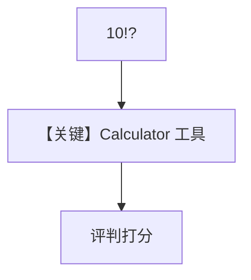

# accuracy_with_tools.py — 实现原理分析

> 源文件：`cookbook/09_evals/accuracy/accuracy_with_tools.py`

## 概述

本示例评测 **带工具的 Agent**（阶乘 `10!`）：被测为 `gpt-5.2` + `CalculatorTools`，期望 `3628800`。

**核心配置一览：**

| 配置项 | 值 | 说明 |
|--------|------|------|
| `agent.model` | `OpenAIChat(id="gpt-5.2")` | 被测 |
| `AccuracyEval.model` | `o4-mini` | 评判 |

## 核心组件解析

与 `accuracy_basic` 类似，强调工具调用链参与最终答案生成。

## System Prompt 组装

被测 Agent 无额外 `instructions`；工具说明由 `# 3.3.5` 等注入。

## 完整 API 请求

`chat.completions.create` + `tools`。

## Mermaid 流程图

## 关键源码文件索引

| 文件 | 作用 |
|------|------|
| `agno/tools/calculator` | 阶乘等 |
